# Three Voice Horns — Proofs of Concept

**Status:** design study, Rev 6 — 2026-08-23. Derived entirely from
[acoustic-metamaterial-laws.md](acoustic-metamaterial-laws.md) (Rev 3) — every claim below cites a
numbered law from that document, and every number is recomputed from those laws, not asserted.
Rev 2 added **the Skin** (interior lining budgets and the smooth-to-thorn exterior gradient, rules
S1–S3). Rev 3 added **the Script** (four inscription systems, rule S4). Rev 4 added **the Fleece**:
the true interior volumetric metamaterial — a dense sub-wavelength lattice lining the bore that
interacts with the player's *wind* while staying invisible to their *voice* (rules W1–W4). Rev 5
factors in **measured evidence** — Zvoníček et al., *Polymers* 2023 (impedance-tube reflection of
FDM PET-G/ASA/PLA) — which changes the wall recipe and the layer heights, bans one infill, and
puts the first measured number under RULE W3. Rev 6 adds **the Forge**: a simulation-screened,
measurement-validated evolutionary search over the three families — protocol, law-bound
objectives, and an executed first tier-1 cycle
([projects/voice-horn-evolution/](../projects/voice-horn-evolution/evolve_clarion.py)). Figures
generated by scratchpad scripts; PNGs in `voice-horn-pocs/`.

**The brief.** A horn you can speak or sing into easily — calling out with a specific vibration —
whose sound is as pleasant to human ears as passive PETG allows, the kind of instrument a
performer or ritualist would raise to fill a room. The laws permit exactly this and forbid several
adjacent things, so the three concepts below divide the honest territory between them:

| | **POC-A Clarion** | **POC-B Volute** | **POC-C Halo** |
|---|---|---|---|
| Voice mode | speech, calling out | sung tone, storytelling | chanted straight-tone drone |
| Mechanism | directivity + squillo (Laws 14.4, §15.11) | horn loading to 170 Hz (Laws 14.7, 14.10) | tuned just chord + ring halo (Laws 14.6, 15.13) |
| Radiation | forward beam, 1–4 kHz | broad, warm, semi-directional | 360° in the horizontal plane |
| Q philosophy | one broad lift, Q ≤ ceiling | none — smoothness is the feature | deliberately high, per §15.9 |
| Governing risk | mouth ripple below 437 Hz | none new; footprint | wobble under vibrato (Law 15.12) |

What "pleasant" means here, in law form rather than sentiment:

1. **Smooth `H(f)`** — no isolated narrow peak (Law 15.3's hollowness, mechanized in §15.10 as a
   phantom back vowel). Shaping is broad and 2–5 dB (§15.1).
2. **Ring-down inside the phoneme clock** for anything meant to carry speech: `Δf·t₆₀ = 2.2`
   (Law 15.13b), so every speech-path resonance keeps ≥44 Hz of bandwidth.
3. **Energy placed where the ear is sharpest** — the 2.4–3.4 kHz window shared by the epilarynx
   and the ear canal (§15.11), delivered by aperture, not by gain (Law 13.1).
4. **Consonance by construction** where resonance *is* the point: low-integer just ratios, so no
   two strong components beat inside a critical band.

And the honest boundary, stated once: **Law 13.1 — no passive gain.** None of these devices adds a
single milliwatt. Each one only *places* the voice: in angle (A), in spectrum (B), or in time (C).
That is also exactly what an opera singer does, which is why it is enough.

---

## Measured anchors — Zvoníček et al., *Polymers* 2023

Until this revision, every audible-band wall property in this study was derived or assumed. One
paper closes part of that gap with instrument-grade measurements on exactly our material and
process: **Zvoníček, Vašina, Pata & Smolka, "Three-Dimensional Printing Process for Musical
Instruments: Sound Reflection Properties of Polymeric Materials," *Polymers* 2023, 15, 2025**
(local copy: `../MDPI Three Dimensional Printing Process for Musical Instruments.pdf`).
Impedance tube per ISO 10534-2, 200–3200 Hz — squarely our speech band — on FDM PET-G, ASA, and
PLA discs (Ø28.9 × 10 mm, 1.8 mm shell, 40%-solid Gyroid / Grid / Cubic infill, layer heights
0.1 / 0.3 / 0.5 mm, 0.4 mm nozzle). Their mean reflection coefficients `β_m` (1 = perfect mirror):

| structure (PET-G) | β_m @ 0.1 mm | @ 0.3 mm | @ 0.5 mm |
|---|---|---|---|
| Grid infill, 40% | 0.919 | **0.963** | 0.940 |
| Gyroid infill, 40% | 0.919 | 0.929 | 0.886 |
| Cubic infill, 40% | 0.705 | 0.878 | **0.632** |
| 100% solid | — | 0.852 *(0.2 mm)* | — |

Five findings, factored into the design:

**F1 — The wall recipe changes: shell + Grid sandwich beats solid.** Their most reflective
printed structure — PET-G, Grid infill, 0.3 mm layers, `β_m = 0.963` — **out-reflects the 100%
solid sample (0.852)**, at a fraction of the mass and print time. All three horn bodies therefore
switch from solid walls to a **sandwich: two-perimeter shells (~1.7 mm each face) over 40% Grid
infill**. A projector wants its bore to be a mirror (Law 13.1 has no dB to spare), and the
measured mirror is the sandwich. The mass saving also serves open question 9 the right way round:
a sandwich is stiffer per gram than solid, so wall resonances move up and shrink.

**F2 — Layer height is acoustically almost free, now with data.** Law 4.3 derived that layer
stepping is not the limiting error term; this paper *measures* it in the audible band: for Grid
and Gyroid the β(f) curves at 0.1/0.3/0.5 mm nearly coincide (their Grid \@ 0.5 mm saves ~60% print
time unharmed). Adopted: **horn bodies print at 0.3 mm** (the Volute spiral body may go 0.5 mm);
the fine 0.16–0.20 mm setting is reserved for the parts whose *geometry* needs it — the QRS well
floors, braille domes, the voice groove, and the Fleece strands.

**F3 — Cubic infill is banned from every acoustic body.** Measured `β_m` swings 0.632–0.878 with
layer height, non-monotonically — the authors call it unpredictable and attribute the loss to
multiple internal reflections in its complex pores. Nothing in these instruments may be sliced
with Cubic infill. (Registered inversely as a resource: a measured NRC up to 0.19 from a 10 mm
printed panel is a legitimate *deliberate* absorber — e.g. a future room treatment — just never
inside a projector.)

**F4 — First measured number under RULE W3.** Their Gyroid at 40% *solid* (porosity 0.60), 10 mm
deep, reflects 0.89–0.93 at normal incidence — an ~0.3–0.5 dB class loss for a structure **4–10×
denser than the Fleece** (porosity 0.85–0.96) at comparable depth. Grazing incidence on a liner
is gentler still. RULE W3's ≤0.4 dB transparency budget was a derivation; it now has a measured
ceiling from the literature sitting comfortably above it.

**F5 — The roughness caveat softens.** The law doc's §5.3 assumed FDM channel roughness of
50–100 μm Ra and warned viscothermal losses could run 1.5–3× high. Zvoníček et al. *measure*
PET-G surfaces at **Sa 9.7–13.9 μm, Sz 76–111 μm** across all three layer heights — an order of
magnitude below the assumption for the areal mean. Vertical walls (layer ridges) remain
unmeasured, but the audible-branch loss figures in §5.5 are likely conservative rather than
optimistic. (Registered in the law doc as a measured `[PARAM]`; see its Rev 4.)

One honest limit on all five: their samples are flat discs at normal incidence in a tube, not
curved horn walls at grazing incidence — the numbers anchor material and structure choices, not
the horn's transfer function. Part XVI's sweeps remain the arbiter.

*(A note their paper makes possible: their mechanical objection to PLA — it cannot carry string
tension — does not apply to a horn, which carries no static load beyond a grip. But PET-G Grid at
0.963 out-reflects everything anyway, and PETG is the shop standard. No change.)*

---

## The Skin — inner metamaterial, outer thorn gradient

All three horns share one skin system: a metamaterial-lined interior and an exterior that grades
from polished to thorned — a pleasure and a pain to hold, by calculation rather than accident.

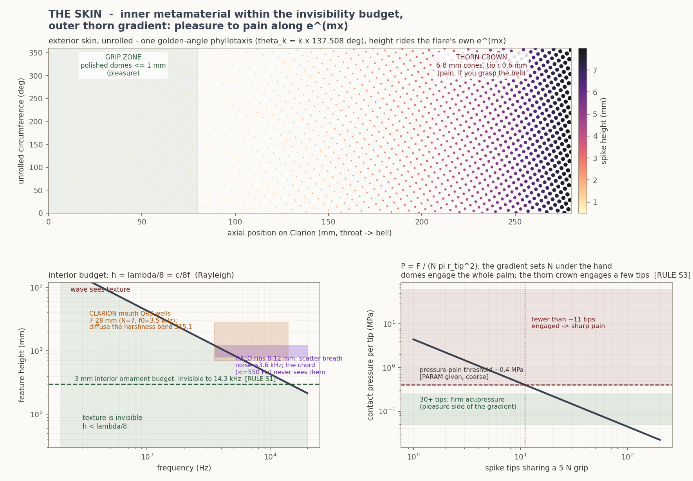

### The three rules

**`[RULE S1]` — The interior invisibility budget.** A wave does not see texture shallower than
roughly an eighth of its wavelength (the Rayleigh smoothness criterion, `h < lambda/8 = c/8f`).
At the top of the speech band (8 kHz, `lambda = 43 mm`) that bound is 5.4 mm; adopt **3 mm with
margin**, invisible all the way to 14.3 kHz. Inside that budget the interior may carry *any*
ornament — scales, script, tessellation, a relief of the phyllotaxis outside — with **zero
acoustic cost**. The wave never learns it is there. Deliberate acoustic features (the QRS wells,
the Halo ribs below) are the ones designed to *exceed* the budget in a chosen band, and only that
band sees them.

**`[RULE S2]` — Ornament follows the flare.** By continuity, particle velocity in the duct scales
as `v ∝ 1/S(x)`: fastest at the throat (×22 over the mouth in the Clarion, so ×500 in `v²`), and
wall interaction scales with `v²`. So texture *density and depth grow with the flare* —
glass-smooth at the throat where the wave works hardest, fully ornamented at the mouth where the
wave barely grazes the wall. The gradient is not styling; it is the continuity equation drawn on
the surface. (The roughness caveat of §5.3 is the same physics: it bites only where channels are
narrow and `v` is high.)

**`[RULE S3]` — The exterior gradient earns its keep twice.**

- *Structurally:* graded ribs and spikes are stiffening studs of continuously varying spacing —
  a panel with graded stiffness has its modes smeared across frequency instead of stacked on one
  resonance. That is the rainbow principle (§14.11) applied to the shell itself, and it is a
  direct mitigation for open question 9 (structure-borne re-radiation) at zero added mechanism.
- *Haptically:* contact pressure per spike tip is `P = F / (N π r_tip²)`. With a relaxed 5 N grip
  and 0.6 mm printed tips (the FDM floor for a durable point), the pressure-pain threshold
  (~0.4 MPa `[PARAM given, coarse]`) is crossed when **fewer than ~11 tips** share the load. The
  gradient sets `N` under the hand: the grip zone's ≤1 mm domes engage the whole palm
  (N large — firm, pleasant, acupressure-like), the thorn crown's sparse 6–8 mm cones engage a
  few tips — sharp. **Where the device may be held is written into the surface**, and the hand
  reads it faster than the eye: sliding from throat toward bell, comfort degrades continuously
  until it refuses. The magician's instrument teaches its own handling.

### The pattern

One distribution serves all three horns: **golden-angle phyllotaxis** — spike `k` at
`theta_k = k × 137.508°`, axial position sampled so density follows the local circumference. It is
blue-noise-uniform (no accidental rows to catch a sliding hand harder than intended), it is this
repo's native geometry, and its spike height rides the horn's own exponential:

```
  h(x)  =  h_dome + (h_thorn - h_dome) · ( e^{m x} - 1 ) / ( e^{m L} - 1 ) ,
  h_dome = 0.5 mm ,  h_thorn = 8 mm ,  tip radius 0.6 mm ,  60° cone angle
```

The same `m` that sets the acoustics (Law 14.7) sets the pain gradient. One constant, three
readings: cutoff frequency, flare curve, thorn law.

### The Script — text on the surfaces, each string doing work

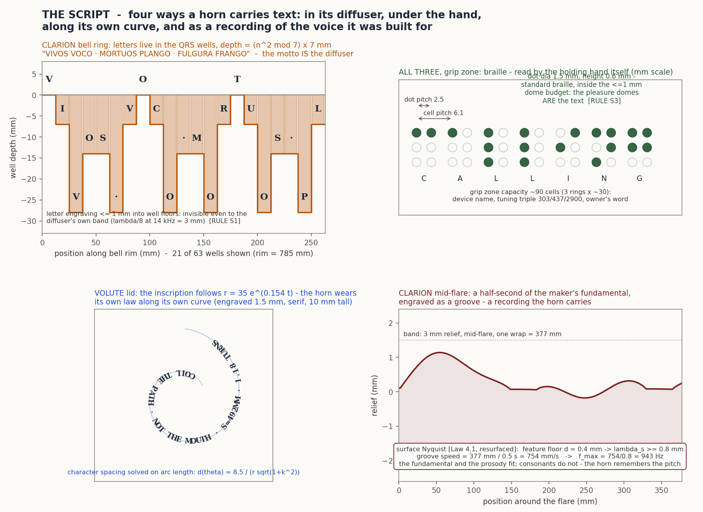

**`[RULE S4]` — Lettering budgets.** Interior lettering obeys RULE S1 (≤3 mm relief; ≤1 mm when
riding on a deliberate acoustic feature, so the feature's own band cannot see it). No text inside
the Halo spheres — a Helmholtz resonator's Q lives on its walls, and the halo is not for spending.
Exterior lettering is acoustically free. Print floors: stroke width ≥0.8 mm (two extrusions),
raised text ≥6 mm tall for a cast-bronze read, engraved ≥1.5 mm deep to survive layer lines.

Four systems, each encoding by a different physical channel — depth, touch, path, and time:

**1. The Motto Ring (Clarion bell) — the inscription *is* the diffuser.** Church bells have
carried cast inscriptions for a millennium; here the tradition is made load-bearing. The bell-rim
QRS diffuser has 63 wells around the 785 mm rim (nine periods of `N = 7`), and each well holds one
serif letter engraved ≤1 mm into its floor. Sixty-three slots take Schiller's bell motto whole:

```
  VIVOS VOCO · MORTUOS PLANGO · FULGURA FRANGO
  (I call the living · I mourn the dead · I break the lightning)
```

The letters ride at depths `(n² mod 7) × 7 mm` — the words undulate through the quadratic-residue
sequence, so reading the motto around the rim *is* reading the diffuser's number theory. The
1 mm letter relief is invisible even to the diffuser's own 3.5–14 kHz band (`lambda/8` at 14 kHz
is 3 mm), so the poetry costs the acoustics nothing. A herald's horn that announces what it is for.

**2. The Grip Braille (all three) — read by the holding hand.** Standard braille is dot Ø1.5 mm,
height 0.6 mm, dot pitch 2.5 mm, cell pitch 6.1 mm — which sits *entirely inside* the grip zone's
≤1 mm pleasure-dome budget. So in the grip zone, the domes are not merely pleasant: they are
**text**, and the hand that holds the instrument correctly is resting on its documentation.
Capacity ~90 cells in three rings: the device name, the tuning triple (`303 / 437 / 2900` for the
Clarion), and one line of the owner's choosing. The same surface is pleasure, provenance, and
accessibility in a single feature — a blind performer reads this horn faster than a sighted one.

**3. The Self-Inscription (Volute lid) — the law along its own curve.** The lid engraving follows
the channel's own spiral `r = 35·e^(0.154 θ)`, characters spaced on true arc length
(`Δθ = 8.5 mm / (r·sqrt(1+k²))` per character, ~58 characters over the 492 mm path) and rotated to
the local tangent:

```
  COIL THE PATH · NOT THE MOUTH · S = 492 MM · 1.18 TURNS
```

The horn wears its governing law written in the geometry the law describes — you read it by
rotating the instrument in your hands, the way a bell-founder's frieze is read by walking around
the bell. Engraved 1.5 mm on the *exterior* lid face (the MPP absorber skin owns the interior).

**4. The Voice Groove (Clarion mid-flare) — a recording the horn carries.** A 3 mm relief band,
one full wrap at the mid-flare (377 mm), encodes a half-second of the maker's actual voice as a
groove — and **Law 4.1 resurfaces to govern it**: the 0.4 mm feature floor makes the surface a
sampled medium with `lambda_s ≥ 0.8 mm`, so at a groove speed of `377 mm / 0.5 s = 754 mm/s` the
recordable bandwidth is

```
  f_max  =  754 / 0.8  =  943 Hz
```

The fundamental and the prosody fit; the consonants do not. The horn remembers the *pitch* of the
voice it was built for — its melody, not its words — which is the correct portion for an
instrument whose whole doctrine (Part XV) is that pitch is the part a structure can hold. Encode
the maker speaking the motto; a future owner with calipers and the sampling law can play it back.

Assignment summary:

| | Motto Ring | Grip Braille | Self-Inscription | Voice Groove |
|---|---|---|---|---|
| Clarion | bell rim (QRS) | throat rings | — | mid-flare wrap |
| Volute | — | inner whorl | lid spiral | — |
| Halo | sphere equators* | chamber waist | slot rim (chord + t₆₀) | — |

*The Halo's spheres each carry a one-word bell-founder inscription at the equator — raised
exterior text, ascending with pitch: **VOX · SURGIT · IMPLET · DOMUM** ("the voice rises and fills
the house") — plus that sphere's data line (`A3 · 220 Hz · Q30 · 412 cm³`), so each orb is signed
like the bell it is. Exterior only; the interiors stay silent glass (RULE S4).

---

## The Fleece — the interior volumetric metamaterial

The Skin's RULE S1 treated the bore as a surface to decorate under an invisibility budget. The
Fleece uses the same physics as a *volume*: the inner walls carry a dense, graded, sub-wavelength
lattice — on the Clarion, **~43,000 cells and ~500 m of single-extrusion strand** — that is a
working metamaterial for the one field the earlier revisions ignored: **the player's wind.**

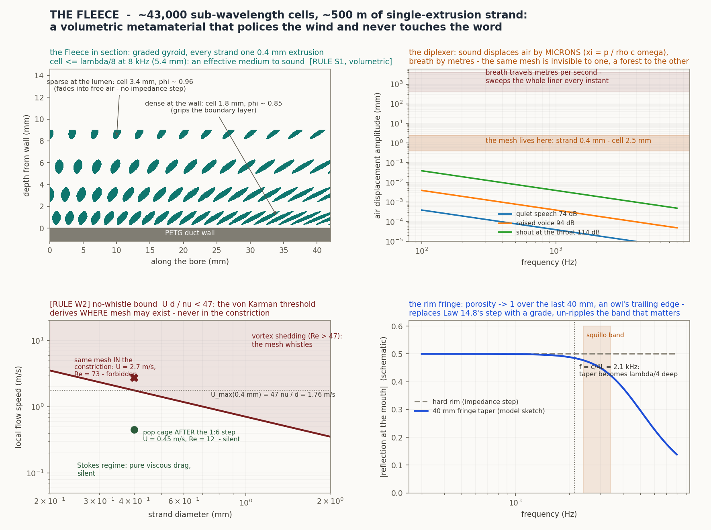

### The founding observation — two fields, one duct, three orders of magnitude apart

A voice horn carries two different things down the same bore, and the laws let us split them:

- The **voice** is an acoustic field. Its particle velocity is `v = p / (rho c)` (the plane-wave
  relation underneath Law 8.2's intensity chain): 2.4 mm/s at a raised-voice 94 dB, 24 mm/s even
  at a 114 dB shout measured at the throat. Its air **displacement** is `xi = v / omega`:
  **4 μm at 100 Hz, 50 nm at 8 kHz.** Sound never moves air farther than a hair's breadth.
- The **wind** is the DC exhaust that carries it: 0.15–1.0 L/s of breath, which through the
  epilarynx constriction (366 mm²) is **0.4–2.7 m/s**, sustained, in one direction, for metres.

`[RULE W1] — The displacement diplexer.` A lattice of 0.4 mm strands at 2.5 mm pitch sits **three
orders of magnitude above** the largest acoustic displacement and **three orders below** the
breath's travel. To the voice it is an effective medium (cell ≤ `lambda/8` at 8 kHz = 5.4 mm — the
same Rayleigh bound as RULE S1, applied volumetrically); to the wind it is a forest. One structure,
two regimes, separated by scale — this is the master relation of the Fleece, and it is why a dense
mesh in the bore is not madness but a diplexer.

And it is legal: **Law 13.1 forbids adding power to the voice; it says nothing about removing
power from the wind.** Breath turbulence is not signal — it is exhaust noise (the rumble, pop, and
hiss a bare horn amplifies along with the words). The Fleece burns the exhaust and ships the word.

### The rules

`[RULE W2] — The no-whistle bound.` A strand in flow sheds vortices (and therefore sings) above
the von Kármán threshold `Re = U d / nu ≈ 47`. For 0.4 mm strands that is `U < 1.76 m/s`. This
**derives the Fleece's placement instead of leaving it to taste**: in the epilarynx constriction
the breath runs up to 2.7 m/s (`Re = 73` — forbidden); one area-step later (1:6, §14.2) it has
dropped to 0.45 m/s (`Re = 12` — deep in the silent Stokes regime, pure viscous drag). **No mesh
in the constriction, ever; the Fleece begins where the flare begins.** The same continuity
argument that graded the ornament (RULE S2) now places the metamaterial — `v ∝ 1/S(x)` is doing
all the work in both rules.

`[RULE W3] — The transparency budget.` The liner's total acoustic flow resistance must stay under
~5% of `rho c` ≈ **20 Rayl** (≤0.4 dB insertion loss) — windscreen-class, met by keeping porosity
≥0.85 and pores ≥0.5 mm. The viscothermal check is Law 5.3's own boundary layer: `delta_v` is
25–70 μm across the speech band, and the FDM pore floor (0.4 mm walls + 0.35 mm gaps, the Part IX
lamellar floor) keeps every pore 7–20× larger — the voice slides through nearly loss-free.
Measured anchor (F4): Zvoníček's printed Gyroid at porosity 0.60 and 10 mm depth still reflects
0.89–0.93 at normal incidence; the Fleece is 4–10× more open, so the budget sits under a
measured ceiling, not just a derived one.

`[RULE W4.5]` — see RULE W5 in the Forge's cycle-6 section: the Fleece must stay in the
open-lattice (effective-medium) regime — **no face sheets, no dense slicer skins at the lumen
interface** — or it becomes a compliant liner and the FEM says that costs 2–12 dB.

`[RULE W4] — Grade everything; step nothing.` The lattice grades from cell 1.8 mm / porosity ~0.85
against the wall to cell 3.4 mm / porosity ~0.96 at the lumen face, dissolving into free air with
no impedance discontinuity anywhere — the cochlea/rainbow lesson (§14.11) applied to a liner. And
because a slightly slow porous layer (`n_eff = sqrt(tortuosity) ≈ 1.02–1.07`) refracts grazing
rays *into* itself, the liner must stay thin: **≤10% of local duct radius.** The bore stays a
horn; the Fleece is its bark, not its wood.

### What the wind feels

1. **Boundary-layer grip.** The dense wall layer immobilizes the breath's turbulent boundary
   layer — eddies entering 1.8 mm cells at centimetre scale are broken below the size where
   `Re < 47` locally, then die viscously. Wall-turbulence noise (the "blowing into a tube" rumble)
   is dissipated at the wall instead of radiated out the mouth.
2. **The pop cage.** Directly after the 1:6 step, a double layer of offset mesh crosses the whole
   bore. A plosive is a momentum pulse (`~rho U²`, a jet); the voice is a pressure wave. Jets
   cannot turn corners — two offset layers attenuate momentum flux by roughly the open-area
   fraction squared — while the pressure wave, whose wavelength dwarfs the layer spacing,
   diffracts through unbothered. The mic-studio pop filter, derived from first principles and
   printed into the throat.
3. **The rim fringe.** Over the bell's last 40 mm the lattice porosity runs continuously to 1 —
   a fringe, the owl's trailing edge. Aerodynamically it de-correlates the exit shear layer
   (breath leaves without an edge tone); acoustically it **replaces Law 14.8's impedance step
   with a grade** — an anti-etalon that suppresses mouth-reflection ripple wherever the taper is
   at least a quarter-wave deep, i.e. above `c/4L = 2.1 kHz`: exactly the squillo band. Below
   2.1 kHz Law 14.8's ripple stands untouched — the fringe helps precisely the band the whole
   design is built around, and the laws say so before anything is printed.

### The honesty clause

The Fleece is **not an absorber**, and Part IV says why it cannot be: true porous absorption needs
pores at the `delta_v` scale (25–220 μm), an order of magnitude below the 0.4 mm nozzle's floor.
That limitation is the design's good fortune — a projector must not absorb its own voice
(Law 13.1 already spent every dB). The Fleece is a **flow conditioner and an impedance grader**;
the printer's coarseness is what keeps it lawful.

### Per horn

- **Clarion:** full Fleece from the area step to the rim fringe (thickness grading 3 → 9 mm with
  local radius, per RULE W4); pop cage after the step; fringe merging into the thorn crown so the
  rim is one continuous structure — feather inside, thorn outside. This supersedes the bare-bore
  reading of the earlier Skin notes: the bore is bare of *relief*, but wears the Fleece where
  rules W2/W4 allow.
- **Volute:** the breath jet cannot follow the spiral — inertia slams it into the **outer wall of
  each turn**. The Fleece lines the outer wall only, thickness ∝ local curvature, eating the
  impingement noise where it is made; the inner wall stays glass (it sees almost no DC flow, and
  the Volute's smoothness doctrine survives). Channel cross-sections inflate ~5% linear to return
  the acoustic area the liner occupies, keeping `S(x)` — and therefore `f_c = 170 Hz` — exact.
- **Halo:** two precision applications instead of a lining. An **inlet diffuser plug** (a mesh
  cylinder ending the voice tube) converts the breath jet into distributed seepage — the chamber
  receives pressure, not momentum, so the drone is fed without wind noise. And each resonator
  neck wears a **wind cowl**: a mesh dome, trivially transparent to the 220–550 Hz chord, that
  blocks DC flow from grazing the neck — because wind across a Helmholtz mouth is an edge-tone
  generator and a detuner (it is how an ocarina is *played*, which is exactly what a tuned chord
  must forbid).

---

## POC-A — CLARION

*The prosthetic epilarynx. For speaking and calling out; the herald's instrument.*

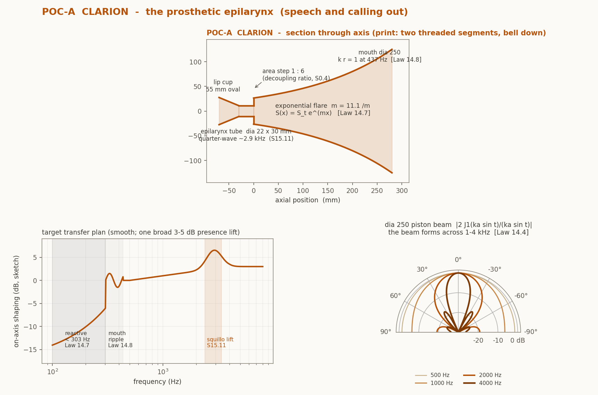

**Signal path.** Lip cup (55 mm oval, no seal) → **epilarynx tube, Ø22 × 30 mm** → 1:6 area step
into the horn throat → exponential flare → Ø250 mouth.

**The trick is the throat, and it is stolen from opera.** The 30 mm constriction is a deliberate
copy of the trained singer's epilaryngeal tube (§0.4, §15.11): its quarter-wave sits near 2.9 kHz,
and the ≥1:6 area step into the horn decouples it so it actually resonates there. Because it is a
**series** element in the main path, it lifts the band; a closed side stub at the same frequency
would instead notch it (§15.4) — that distinction is the whole design. Horn loading keeps the
resonance heavily damped: expected Q ≈ 10–20 against a Law 15.13 ceiling of ~65 at 2.9 kHz, giving
a broad 3–5 dB *squillo* lift rather than a honk.

**Numbers** (all from the laws, figure panel 1):

```
  throat A_t = 2 199 mm2 (40 x 70 oval)     mouth A_m = 49 087 mm2 (dia 250)
  L = 280 mm   ->   m = ln(22.3)/0.28 = 11.1 /m
  cutoff      f_c     = m c / 4 pi  =  303 Hz        [Law 14.7]
  mouth match f_match = c / 2 pi r  =  437 Hz        [Law 14.8]
  beam: dia-250 piston, forms across 1-4 kHz         [Law 14.4]
```

The low edge is overdetermined (§14.7's three-way pile-up), so the Clarion does not pretend to
bass: below ~440 Hz it rides mouth ripple, and below 303 Hz it is reactive. What it delivers is
what §14.5 promised — clarity and presence before chest weight — sharpened by the squillo lift
into the exact window where the orchestra is quiet and the ear canal peaks (§15.11). Calling a
name across a field with this is calling it in the band the listener's own anatomy amplifies.

**Why it is pleasant.** Nothing narrow anywhere in the path: one broad lift, a single outlet (no
comb, §15.7), no coiling (no `sqrt(f)/h` consonant tax, Law 5.4), and the 1–4 kHz beam means
consonants arrive un-smeared (§15.6). The Clarion flatters a voice by *finishing* it the way
training would.

**Skin.** Interior: smooth bore through throat and mid-flare (RULE S2 — this is where `v` is
highest), then a **quadratic-residue diffuser ring** scalloped into the final 40 mm of bell:
`N = 7`, design frequency 3.5 kHz, well depths `(n² mod 7) × 7 mm = 0/7/28/14/14/28/7` — a
number-theoretic surface that scatters the 2.5–5 kHz harshness band (§15.1) evenly off-axis while
the squillo lift stays. Below 3.5 kHz the wells are invisible (RULE S1); the beam is untouched.
Sub-3 mm relief ornament everywhere else in the bell, free of charge. Exterior: the full
phyllotaxis gradient — polished dome grip zone over the throat segment, thorn crown around the
bell rim. The thorns double as the bell's stiffening ring (RULE S3), exactly where a Ø250 shell
wants one.

**Print.** Two threaded segments (throat+cup, flare+bell), bell down, zero overhang worth
supporting; Ø250 bell and 280 mm total length inside the 320³ envelope. Walls are the measured
**F1 sandwich**: two-perimeter shells over 40% Grid infill, total ~5 mm (`β_m = 0.963`, the most
reflective printed structure in the Zvoníček data — never Cubic, F3). Body at 0.3 mm layers (F2);
QRS wells, braille, and groove at 0.16 mm. The sandwich plus the graded exterior studs are the
first line against open question 9 (knuckle-rap test at step 2 tells you if they sufficed).
Thorns at 60° cone angle self-support when the bell prints mouth-down.

---

## POC-B — VOLUTE

*Folded warmth. For sung tone and storytelling; the bard's shell, held like a nautilus.*

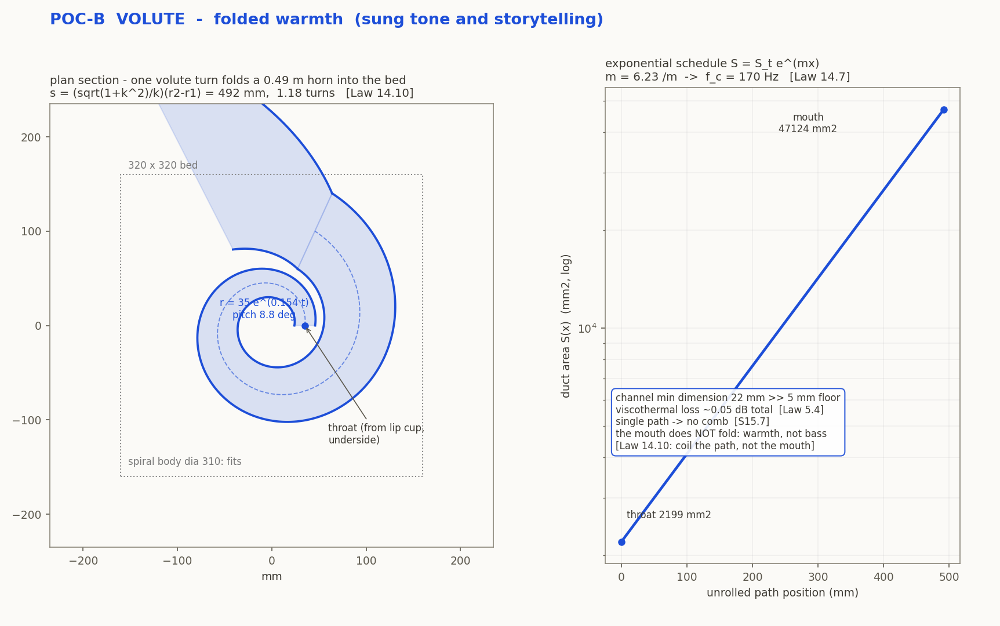

**The idea.** The Clarion gives clarity and admits it has no body below ~440 Hz. The Volute buys
the 200–500 Hz "vocal body" band (§15.1) the only lawful way: **more horn**, folded. A 170 Hz
cutoff needs `m = 6.23 /m` and therefore `L = ln(A_m/A_t)/m = 0.49 m` of taper — impossible
straight, trivial folded:

```
  log spiral r = 35 e^(0.154 theta) mm ,  pitch angle 8.8 deg
  s = ( sqrt(1+k^2)/k ) (r2 - r1) = 492 mm  in 1.18 turns      [Law 14.10]
  spiral body dia 310  ->  fits the bed flat
```

**And the law it obeys rather than fights:** *coil the path, not the mouth* (Law 14.10). The
300 × 200 mm oval bell (a second printed segment) still matches only down to 446 Hz (Law 14.8), so
the Volute does **not** project bass — it *loads* the chest register. Below f_match the deep taper
still presents a gradual impedance rise to the throat, so the singer feels the instrument answer
back down to ~170 Hz — easier, fuller phonation (the same reflected-load support singers get from
a hard proscenium) — while the room hears warmth, not a subwoofer. The claim is bounded and
honest: felt support to 170 Hz, radiated warmth 300–500 Hz, projection 1–4 kHz as before.

**Law compliance, explicitly:**

- Channel minimum dimension 22 mm ≫ the 5 mm floor: total viscothermal loss ≈ 0.05 dB — the
  consonant band is untouched (Law 5.4, §5.5).
- One continuous path, one outlet: no comb filtering, no swimming timbre (§15.7).
- No resonant chambers at all. The Volute's entire aesthetic is **smoothness** — its `H(f)` is the
  closest of the three to a pure gentle tilt, which is why it suits sustained singing: Law 15.14's
  sparse harmonic comb finds no narrow feature to land on or miss.
- The exponential schedule is exact (figure panel 2): `S(x) = 2199·e^(6.23x)` mm², throat to
  47 124 mm² in 492 mm.

**Skin.** The Volute's acoustic identity is smoothness, and RULE S2 protects it: the channel
interior stays polished for the whole turn (this is the one horn where the wave hugs the wall the
longest, so the interior budget is spent on *nothing*). The metamaterial goes where the wave
isn't: the two flat spiral lids — the largest, most resonance-prone panels in all three designs —
carry a **micro-perforated absorber skin** on their interior faces (0.8 mm holes, ~5% open area,
1.2 mm face over a 4 mm printed air gap → absorption centered near 4.5 kHz), eating breathy
harshness (§15.1) and damping the very panels open question 9 worries about, in one layer.
Exterior: the phyllotaxis gradient runs *along the spiral path* — the hand naturally cradles the
smooth inner whorl (grip zone at the throat end, per RULE S3), and the thorns emerge through the
outer half-turn toward the bell, so the shell reads like a sea creature: soft where it is held,
armored where it speaks.

**Print.** *(Forge history: cycle 7 flagged the cross-section morph as failing the spiral
packing gate under a fixed-height model; cycle 10, with the height grading modeled properly,
vindicated the graded design — and went further: an 871 mm path at k = 0.11, channel 95 → 246 mm
tall, gives **f_c = 100 Hz** inside the Ø310 body. Build the cycle-10 KNEE; see "Cycles 9–11".)*
Flat spiral body (Ø310 × ~180 mm tall, cross-section morphing 40×55 → 160×295 through
the turn) plus threaded bell segment. Walls: the F1 sandwich (shell + 40% Grid — the long spiral
bore is the design's biggest reflecting surface, so the 0.963-vs-0.852 measured margin matters
most here); body at 0.3–0.5 mm layers per F2, lid inscriptions at 0.16 mm. The geometry is its
own ornament — the volute is the nautilus the magician would have commissioned anyway, except
every curve is load-bearing.

---

## POC-C — HALO

*The room-raiser. A chanted drone becomes a standing chord with a chapel's decay, radiated 360°.*

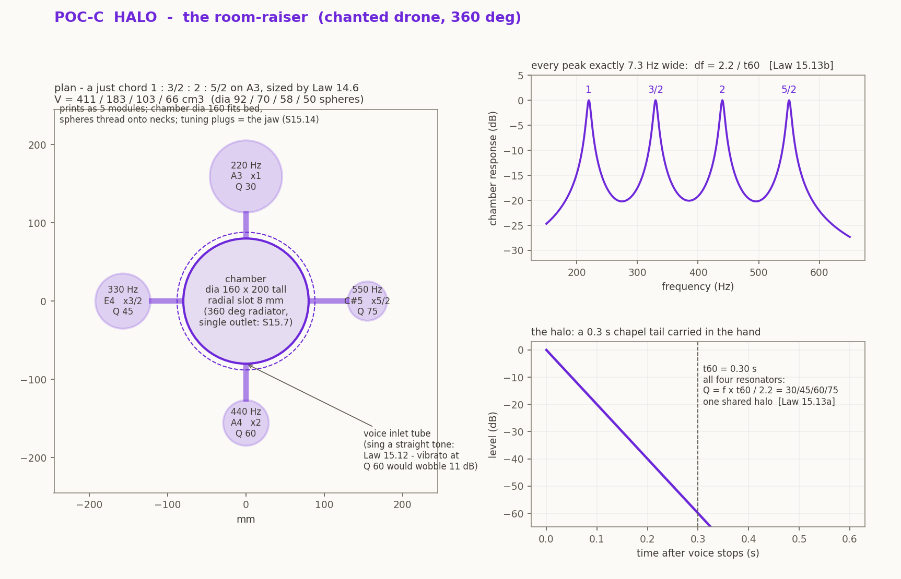

**This is the §15.9 device built deliberately** — the doc's own license: a ritual voice-coloring
chamber is "not a bad device, it is a different device." Where A and B avoid resonance, the Halo
is *made* of it, and every sharp edge the laws warned about is turned into the mechanism.

**Architecture.** The performer chants a straight tone into an inlet tube feeding a central
chamber (Ø160 × 200 mm). Around it, four Helmholtz spheres tuned to a **just chord on A3** open
into the chamber; a single 8 mm radial slot radiates the sum in all horizontal directions (one
outlet — §15.7 satisfied even here).

```
  ratios      1     :   3/2   :    2    :   5/2        (just intonation - no beating
  notes      A3 220    E4 330    A4 440    C#5 550      inside a critical band)

  sized by Law 14.6, neck dia 20 x 30 mm (L_eff = 47 mm):
  V        =  412      183       103        66   cm3   (spheres dia 92/70/58/50)
```

*(Superseded by Forge cycles 8 and 11: these isolated-tuning volumes ring 265 cents off once
coupled to the chamber. Print the cycle-11 set — V = 626/212/189/113 cm³, per-sphere neck radii
5.4/11.1/14.9/14.4 mm ascending with pitch, L_n = 35 mm, slot 4 mm — which rings 6 cents off with
ring-time error halved; see "Cycles 9–11". The ratios and the constant-ring-time law are
unchanged; only the geometry that achieves them in situ is.)*

**The elegant part — a constant ring time.** Law 15.13b says `Δf·t₆₀ = 2.2`. Choose one halo for
the whole chord — **t₆₀ = 0.3 s**, a small chapel's tail — and the law hands you the tuning table:

```
  Q_i  =  f_i * t60 / 2.2   =   30 / 45 / 60 / 75
  every peak exactly  Δf = 2.2/0.3 = 7.3 Hz  wide
```

Four resonators, four Q values, **one shared decay**. When the voice stops, the whole chord dies
together, smoothly, over 300 ms — no member of the chord outlasting the others. That coherent tail
is the "raised room": the performer's tone keeps standing in the air a third of a second after
their lips close, in a chord too consonant to beat. (Physically: a tuned, slowly-released
pressure field — Law 13.2's resonant-storage row, with the cost paid knowingly in bandwidth.)

**The rule the performer must obey — and why chant sounds the way it does.** Law 15.12: at Q = 60,
a ±½-semitone vibrato transcribes into ~10–11 dB of amplitude wobble at 5–7 Hz — a broken-sounding
flutter. The Halo therefore demands **straight tone**, and rewards it; which is precisely the
practice every drone tradition (plainchant, organum, dhrupad) converged on around resonant
architecture. The device enforces the discipline its ancestors taught.

**Tuning.** Threaded volume plugs in each sphere are the device's jaw (§15.14): ±10% volume moves
each resonance ∓5% (`f ∝ V^(-1/2)`, Law 14.6), so the chord centers anywhere from ~G3 to ~B3 to
match the performer's comfortable drone — the design is ratio-based, not pitch-based, so any
tradition's preferred reference lands by turning four plugs, no reprint. Speech through the Halo
will sound hollow and smeared — by design, per §15.4/15.5 — this is an instrument, not a megaphone.

**Skin.** The Halo gets the true interior metamaterial: a **graded rib array** lining the chamber
wall, rib heights sweeping 8 → 12 mm around the circumference — a printed rainbow fragment
(§14.11). The chord (220–550 Hz, `lambda ≥ 0.62 m`) never sees the ribs (RULE S1 territory,
two orders below `lambda/8`); the performer's breath noise and sibilance above ~3.6 kHz sees them
fully and is scattered and absorbed instead of hissing out of the slot. **The lining purifies the
drone**: the chamber stores the chord and swallows the noise, passively sorting the voice into
keep and discard by wavelength alone. The four spheres stay glass-smooth inside (a Helmholtz
resonator's Q lives on its walls — texture there would spend the halo). Exterior: the gradient
runs radially — a polished equator band where the chamber is carried against the body, thorn
density rising over each sphere toward its pole, so the assembled device is a crown: four thorned
orbs around a smooth heart, painful to seize by any sphere, comfortable only when held the way it
was designed to be held — at the center, like an offering.

**Print.** Five modules: chamber (Ø160 fits the bed with margin) plus four spheres threading onto
neck bosses; assembled span ~Ø410 — segmentation per the repo's hardware rule. Walls: F1 sandwich
for chamber and spheres — a resonator's Q is spent by wall loss, so the spheres take the most
reflective measured recipe (Grid 0.3 mm, `β_m = 0.963`) with the smooth glass interior shell
facing the cavity; Cubic banned everywhere (F3). Rib lining prints integrally with the chamber
(vertical walls, no support); thorn fields at 60° self-support.

---

## The Forge — evolution as a law-governed search

Rev 6 adopts a proposal supplied with the brief: implement evolution as a
**simulation-screened, measurement-validated multi-objective search** — evolve a small parameter
vector driving robust CAD generators (never raw triangles), screen candidates through a cheap
model, and print only a handful of Pareto survivors. NSGA-II is the right starting algorithm
because our goals genuinely conflict (gain, directivity, back-pressure, size, printability), and
Pareto ranking preserves the tradeoff set instead of collapsing it into one questionable score.
The proposal is adopted whole; the laws sharpen it in four places, and the first cycle has
already been run.

### Where the laws sharpen the generic protocol

1. **Ripple and Q are constraints, never objectives.** An optimizer allowed to *trade* spectral
   smoothness will sell it for gain and produce exactly the peaky, nasal device §15.4 catalogues.
   Law 15.13 (`Δf·t₆₀ = 2.2`) and the §15.5 Q budget therefore enter as **hard feasibility
   bounds** (first cycle: ≤12 dB ripple, 500 Hz–4 kHz), not as a fifth thing to maximize.
2. **The manufacturability gate already exists.** Part IV floors (nozzle, layer, zone width),
   rules S1–S4 and W1–W4, and the measured F1–F3 (sandwich walls, layer heights, Cubic ban) *are*
   the gate — evaluated before any acoustics, exactly as the proposal demands.
3. **The genes are fewer than they look, because the laws already fixed most dimensions.** Wall
   recipe (F1), layer heights (F2), Fleece parameters (W1–W4), skin and script (S1–S4) are frozen
   at their derived/measured values in cycle one. Only the *bore* evolves.
4. **Back-pressure is not just comfort — it is §15.2.** The input impedance the horn presents is
   a load on a resonant instrument; too much reflection changes how the tract phonates and can
   shift formants. `Γ̄ = mean |(Z_in − ρc/S_t)/(Z_in + ρc/S_t)|` is the phonation-load proxy and
   a first-class objective.

### Genes per family

| Family | Genes (cycle 1) | Frozen by prior law |
|---|---|---|
| **Clarion** (axisymmetric) | `r_t, r_m, L, n` in `r(u) = r_t + (r_m−r_t)u^n`, + one windowed mid-bore bulge `(A, x₀)` — 6 total | epilarynx tube & 1:6 step (§15.11), Fleece placement (W2), sandwich wall (F1), rim fringe |
| **Volute** (folded) | + spiral `k`, channel aspect schedule, `f_c` target — path length from Law 14.10 | outer-wall Fleece, no-comb single path (§15.7), mouth = aperture bound (Law 14.8) |
| **Halo** (resonator-loaded) | chord ratios? **no** — ratios are the instrument; genes are `t₆₀`, neck `A/L_eff`, chamber Ø, slot width | constant-ring-time law (15.13b), wind cowls (W2), sphere interiors bare (S4) |

### The funnel, with this shop's tools

| Tier | Model | Cost | Count |
|---|---|---|---|
| 1 | Webster transfer-matrix: 160-segment staircase bore, baffled-piston radiation load (`R₁+iX₁` via `J₁`, Struve `H₁`), piston directivity `Q = (ka)²/R₁(2ka)` — 12 third-octave bands, 315 Hz–4 kHz, speech-weighted | ~ms per candidate | thousands |
| 2 | 2-D axisymmetric FEM — **scikit-fem is already installed** (docs/PYTHON_TOOLING.md); Helmholtz + radiation boundary for polar response the 1-D model cannot see | minutes | tens |
| 3 | Part XVI rig, upgraded per the proposal (below) | a print + an hour | 3–5 per cycle |

Tier-1 code: [projects/voice-horn-evolution/evolve_clarion.py](../projects/voice-horn-evolution/evolve_clarion.py)
— evaluator plus a self-contained NSGA-II (SBX, polynomial mutation, constraint-domination), no
new dependencies per the PYTHON_TOOLING policy (`pymoo` is the right upgrade when the search
grows genes; nothing here precludes it).

### First cycle, executed

Population 64 × 75 generations = **4,864 tier-1 evaluations**, seed 7, six genes, Clarion family:

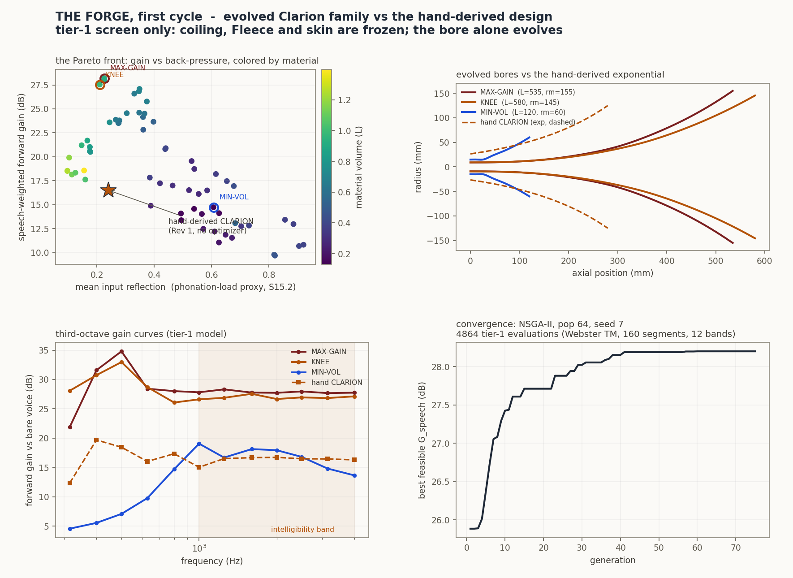

Results and the three lessons they teach:

- **The hand-derived Clarion lands on the Pareto front.** `G_speech = 16.5 dB`, `Γ̄ = 0.241`,
  0.61 L — and **no evolved candidate dominates it** across all five objectives. The Rev 1–5
  design, derived purely from the laws, is already Pareto-competitive. The Forge's job is not to
  replace it but to map its neighbors: the front shows what each further dB costs.
- **The gain corner is real but priced.** MAX-GAIN reaches `28.2 dB` (+11.7 over the hand design)
  with `Γ̄ = 0.226` — a 535 mm, Ø310-mouth, two-segment horn: more bore, more mouth, more print.
  The KNEE candidate (580 mm, Ø291) trades one gain dB back for the lowest reflection on the
  high-gain shelf. Both confirm Law 14.7 read forward: gain in this family is bought almost
  entirely with length and aperture, and the bed constraint (via the segment-count objective) is
  what holds the population inside printability.
- **The optimizer found the model's seam — which is the funnel working as designed.** Every
  high-gain candidate drives the throat to the 9 mm gene floor: under tier 1's ideal
  constant-flow source, a smaller throat is free pressure gain. A Ø18 mm throat is not
  phonatable, and this is precisely the "narrowing/impedance-mismatch artifact" the proposal's
  step 8 warns the first cycle should expose. **Cycle-2 corrections:** raise the throat floor to
  the epilaryngeal coupling value (`r_t ≥ 13 mm`, §15.11's 1:6 step), and replace the ideal flow
  source with a finite glottal source impedance — candidate open question for the law doc.
- One honest methods note: with five objectives and pop 64, the final population is entirely
  non-dominated — the known many-objective weakening of NSGA-II. Fine for a first map; cycle 2
  should either drop to the three load-bearing objectives (gain, reflection, print) or move to a
  reference-point method (NSGA-III class) at larger population.

### Second cycle, executed — the honest source

Cycle 2 applies the recorded corrections: **throat floor raised to `r_t ≥ 13 mm`** (the
anatomical epilaryngeal coupling), the ideal flow source replaced by a **Norton glottal source
with `Z_s = 4 MPa·s/m³`** (`[PARAM]` given, coarse — mid-range of the 30–100 cgs-acoustic-ohm
glottal resistance in the phonation literature; registered in the law doc §0.4), and the
objective set cut to the three load-bearing ones (gain, reflection, print cost). Same budget:
4,864 tier-1 evaluations, seed 7.
Code: [projects/voice-horn-evolution/evolve_clarion_c2.py](../projects/voice-horn-evolution/evolve_clarion_c2.py).

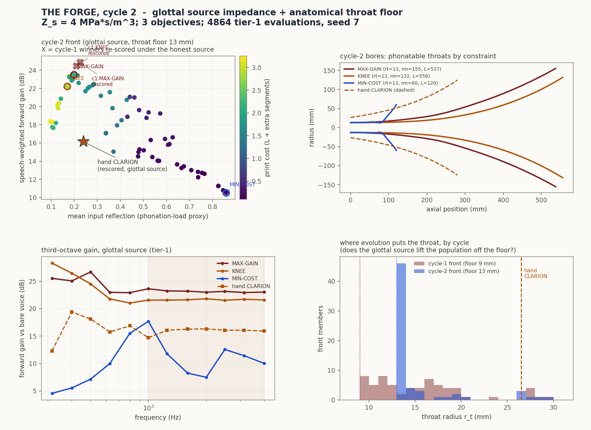

- **The mirage is quantified.** Cycle 1's MAX-GAIN re-scores from 28.2 → **24.8 dB** under the
  glottal source (−3.4 dB was pure ideal-source artifact), and its Ø18 throat is now infeasible
  besides. The honest, phonatable gain ceiling of the family is **23.5 dB** — still **+7.4 dB**
  over the hand Clarion (which re-scores 16.5 → 16.1, barely moving: its large throat hardly
  loads the glottis at all). The hand design remains undominated.
- **The floor binds, and that is the finding, not a failure.** 42 of 64 front members sit exactly
  at `r_t = 13 mm`. The physics is legible: maximum power transfer wants `Z_in ≈ Z_s`, i.e.
  `S_t ≈ ρc/Z_s` → `r_t ≈ 5.7 mm` — smaller than any mouth can drive. So the optimal throat is
  **the smallest one anatomy permits**, and throat size leaves the design space: it is pinned to
  the interface, and further gain is bought only with length and mouth (Law 14.7, again).
- **A real design tension surfaced.** The cycle-2 winners want a 13 mm throat, but §15.11's
  squillo mechanism needs the ≥1:6 area step from the epilarynx tube into the horn throat — at
  `r_t = 13` that step collapses to ~1:1.4 and the series resonance decouples no longer. Tier 1
  cannot see this because the mouthpiece/epilarynx tube is not in its chain. **Cycle-3
  correction:** model the lip cup + epilarynx tube + step as the first elements of the transfer
  matrix, so throat size and squillo are optimized together instead of traded blindly. Until
  then, the buildable compromise stands: keep the Rev-1 throat for the squillo device; print one
  KNEE candidate (`r_t 13, r_m 132, L 556, Γ̄ = 0.170` — *lower* reflection than the hand design
  with +6 dB) as the projection-first variant, and let the Part XVI rig arbitrate.
- Methods note: with three objectives, the whole final population settling onto the front surface
  is convergence, not the many-objective pathology of cycle 1 — the front is now a genuine 2-D
  tradeoff sheet (visible in panel 1 as the gain/reflection/cost shell).

### Third cycle, executed — the epilarynx chain, and what it decided

Cycle 3 puts the device's vocal-tract prosthesis into the model: the chain is now **lip cup
(fixed Ø45 → tube taper, 40 mm) → epilaryngeal tube (genes `r_e`, `L_e`) → area step → horn
bore**, with the glottal source at the cup and reflection measured where the lips actually are.
Eight genes, constraint `r_t ≥ r_e`, same budget (4,864 evaluations, seed 7).
Code: [projects/voice-horn-evolution/evolve_clarion_c3.py](../projects/voice-horn-evolution/evolve_clarion_c3.py).

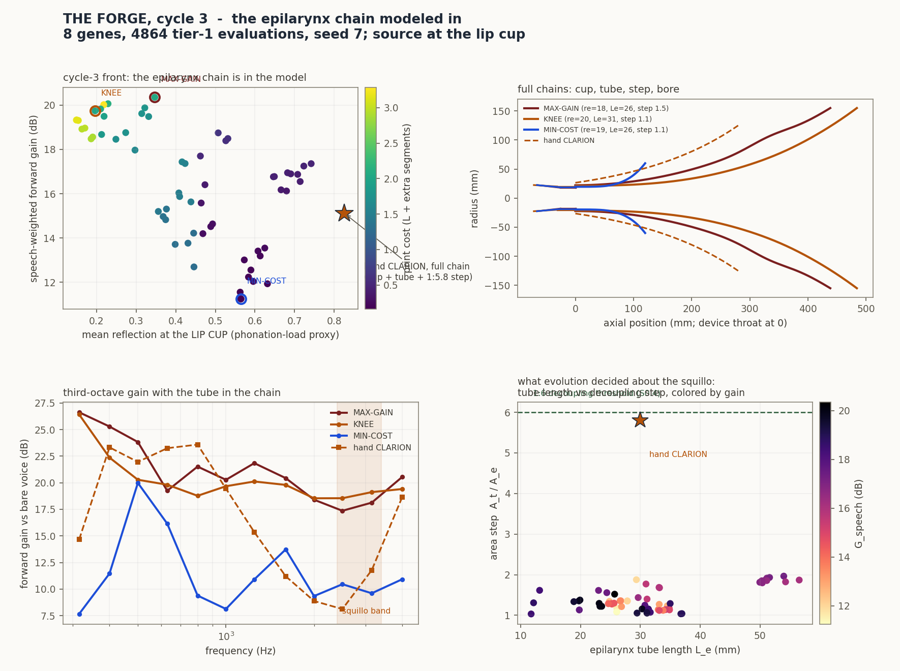

- **The honest ceiling drops again: 28.2 → 23.5 → 20.3 dB.** Each cycle of added physics costs
  decibels and buys truth. The cycle-3 KNEE — a wide Ø40 tube, step 1.1, 484 mm bore, Ø310
  mouth — delivers `G = 19.7 dB` at `Γ̄ = 0.196`, now measured at the lips.
- **The optimizer, asked for a megaphone, removes the opera singer.** Zero of 64 front members
  keep an area step ≥ 6; the whole front sits at step 1.0–2.0 with wide tubes
  (`r_e` 15–20 mm). Under broadband-projector objectives the epilaryngeal constriction is a pure
  cost: it reflects at the cup, and its resonant lift buys nothing that `G_speech`'s smooth
  weighting rewards. And the hand Clarion's full chain is now **infeasible** — its squillo
  feature produces ~15.5 dB of ripple against the 12 dB constraint — and dominated by 24 members.
- **This is a classification, not a defeat.** §15.11's mechanism was never a power play: the
  singer's formant wins by *salience* — placing energy where the orchestra's masking spectrum is
  quiet and the ear canal peaks — and `G_speech` contains no masking model, so the optimizer
  cannot see that value. Cycle 3 therefore formally splits the Clarion into the doc's own two
  lanes: the **projector variant** adopts the cycle-3 KNEE geometry (no constriction, smooth wide
  chain), while the **squillo Clarion** keeps its Rev-1 constriction as a deliberate §15.9-class
  colorist instrument, *exempt from the ripple constraint by declaration* — its 15 dB feature is
  the point. The Forge sorted one device into two honest ones.
- **Cycle-4 options, recorded:** (a) a salience-weighted objective for the colorist lane
  (orchestral-LTAS masking penalty + ear-canal weighting — would restore the squillo and let the
  tube genes tune it); (b) locally-reacting wall impedance in the transfer matrix, bringing the
  rim fringe and liner boundary into tier 1; (c) tier-2 scikit-fem axisymmetric verification of
  the cycle-3 KNEE before printing.

### Fourth cycle, executed — salience, and the rediscovery of the singer

Cycle 4 runs the colorist lane on its own fitness. Salience is modeled as a **soft-max, not a
mean** — a voice cuts through a masker when *one* band clears it, which is the entire content of
§15.11 — so the objective is `S = τ·ln Σ exp((G(f)+env(f))/τ)`, τ = 3 dB, where the environment
`env(f)` is built from the §15.11 ingredients (`[PARAM]` given, coarse): voice LTAS −8 dB/oct
above 500 Hz, orchestral/crowd masker −9 dB/oct, A-weighting, and a +4 dB ear-canal bump at
3.4 kHz. Per the cycle-3 declaration the ripple constraint is dropped in this lane (the peak *is*
the instrument), with a `G_speech ≥ 8 dB` floor so it stays a voice and not a whistle. Same
chain, genes, source, and budget as cycle 3.
Code: [projects/voice-horn-evolution/evolve_clarion_c4.py](../projects/voice-horn-evolution/evolve_clarion_c4.py).

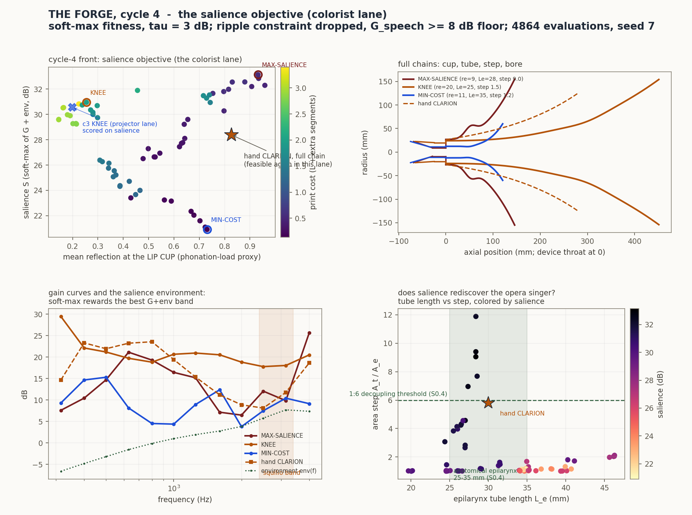

- **Evolution rediscovered the opera singer.** The MAX-SALIENCE candidate is a narrow Ø17.8 tube,
  **28.4 mm long — quarter-wave at 3.0 kHz, dead center of the singer's-formant band — behind a
  1:9 area step**, on a short 146 mm bore (`S = 33.1 dB`). Thirty-six of 64 front members put the
  tube inside the anatomical 25–35 mm epilarynx range, and the whole high-salience cluster sits
  at steps 7–12, above the 1:6 decoupling threshold. Given nothing but a masking spectrum and an
  ear curve, the optimizer converged on human laryngeal anatomy — Sundberg's mechanism, evolved
  from first principles in 4,864 evaluations. The hand Clarion (star, step 5.8, L_e 30) sits
  inside that cluster: feasible again in this lane (`S = 28.4 dB`), dominated by only 7 members.
- **The two lanes are one front, read end to end.** The cycle-3 projector KNEE re-scores at
  `S = 30.6 dB` — high salience by sheer broadband gain, at four times the print cost of the
  MAX-SALIENCE ring device (0.54 vs ~2.0). The front spans continuously from *small, resistant,
  ringing* to *large, comfortable, loud*: the ritual instrument and the megaphone are the two
  ends of a single tradeoff sheet, and the cycle-4 KNEE (Ø40 tube, mild step 1.5 tuned near
  3.5 kHz, 451 mm bore, `S = 31.0`, `G_speech = 20.1`, `Γ̄ = 0.255`) is the hybrid worth
  printing: projector body, whisper of ring.
- **An honest note on the reflection axis in this lane.** MAX-SALIENCE carries `Γ̄ = 0.93` — the
  ring is bought with heavy reflection at the lips, exactly matching the lived experience that
  squillo technique feels *resistant*. And the phonation literature says supraglottal inertive
  reactance can actually assist vocal-fold oscillation, so in the colorist lane high `Γ̄` is not
  purely a cost the way it is for the projector — a trained user may want the load. The proxy's
  sign convention is projector-lane thinking; the rig (Part XVI step 6, spoken *and sung*) is the
  arbiter of what a performer can actually drive.

### Tier 2, executed — the FEM pass on the cycle-4 KNEE

The funnel's second stage, run on the printing candidate: a 2-D axisymmetric Helmholtz FEM
(gmsh mesh, scikit-fem assembly, 37,040 P2 dofs) of the **full meridian chain** — cup, tube,
step, bore — radiating through the mouth plane into a baffled half-space closed by a first-order
(BGT-1) radiation arc 1.0 m from the mouth. Rigid walls are natural boundaries; the drive is a
velocity piston at the cup with the same Norton glottal source applied through the computed
input impedance, so tier 1 and tier 2 differ **only in the structure model**.
Code: [projects/voice-horn-evolution/tier2_knee_c4.py](../projects/voice-horn-evolution/tier2_knee_c4.py).
*(Toolchain note: the documented FEM stack had drifted off the machine; gmsh/meshio/scikit-fem
were restored at PYTHON_TOOLING's pinned versions.)*

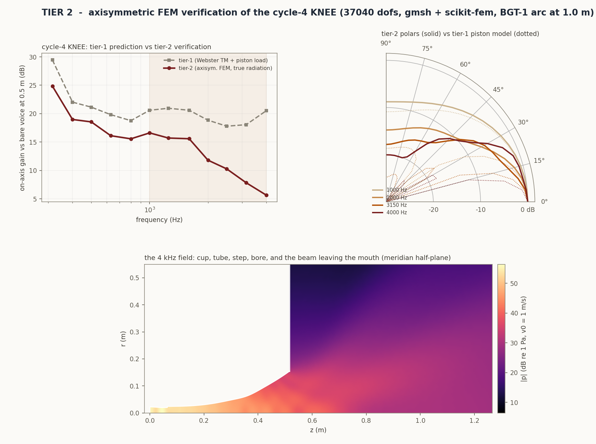

| band | 315 | 500 | 800 | 1250 | 2000 | 3150 | 4000 | `G_speech` | `Γ̄` |
|---|---|---|---|---|---|---|---|---|---|
| tier-1 G (dB) | 29.4 | 21.1 | 18.8 | 20.9 | 18.9 | 18.1 | 20.5 | **20.1** | 0.257 |
| tier-2 G (dB) | 24.8 | 18.5 | 15.6 | 15.7 | 11.8 | 7.8 | 5.6 | **13.5** | 0.241 |

Three verified findings:

1. **The 1-D impedance chain is validated.** `Γ̄` agrees to 0.016 and the band-by-band reflection
   structure matches — so the phonation-load objective, the cutoff physics (Law 14.7), and the
   mouth-matching behavior (Law 14.8) that drove all four evolution cycles are trustworthy.
   Below ~1.6 kHz the gain curves track with a systematic ~3 dB tier-1 optimism.
2. **Tier-1's piston directivity is the high-band lie.** Above 2 kHz the on-axis gap grows to
   −15 dB at 4 kHz: FEM directivity saturates at 12–13 dB where the uniform-piston model promises
   21, and at 4 kHz the FEM polar actually **peaks 25–35° off-axis with an on-axis dip** — the
   wavefront leaving a wide-mouth horn is curved and rim-tapered, not a piston. This is
   precisely the "optimizing on-axis level creates on-axis/off-axis minima" caution carried in
   the Forge's reference list, now observed in our own model. §15.4 row 5, quantified.
3. **A tier-1.5 correction falls out of the data.** The FEM's saturated DI matches the flare-cone
   coverage estimate: `Q_cone = 2/(1 − cos θ_flare)` with `θ_flare` from the mouth-edge wall
   slope (36° for the KNEE → DI ≈ 10.2 dB vs FEM's 12–13). Recorded correction for cycle 5+:
   `Q_eff = min(Q_piston, Q_cone)` — one line in the tier-1 evaluator, kills the high-band
   mirage for wide mouths without re-running FEM per candidate.

Revised verdict on the printing candidate: the KNEE's honest `G_speech` is **13.5 dB**, and its
character is *presence, not brilliance* — the beam is strongest at 1–2.5 kHz and softens on-axis
above 3 kHz. Since piston-DI inflation grows with mouth size, big-mouth candidates were the most
flattered by tier 1; rankings among similar mouths survive. The build decision stands — print the
KNEE and the Rev-1 squillo Clarion, measure per Part XVI — with expectations now set by a model
that has earned them.

### Fifth cycle, executed — the corrected lens and the collimation move

Cycle 5 re-runs the projector lane with tier 2's lesson installed as the **tier-1.5 directivity
cap**: `Q_eff = min(Q_piston, 2/(1 − cos θ_exit))`, θ_exit read from the bore wall at the mouth.
Everything else is cycle 3 — same chain, source, genes, constraints, budget.
Code: [projects/voice-horn-evolution/evolve_clarion_c5.py](../projects/voice-horn-evolution/evolve_clarion_c5.py).

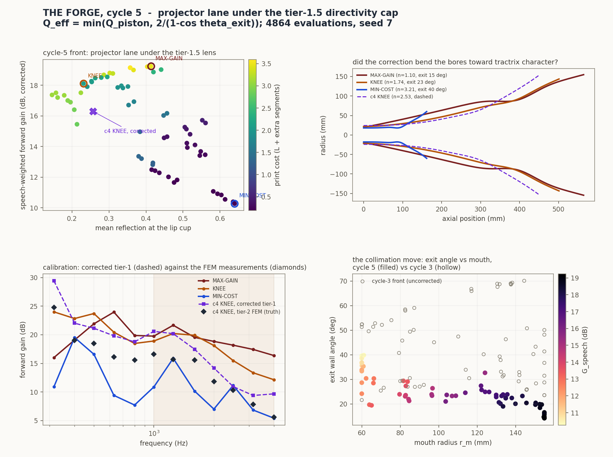

- **Calibration first.** The cycle-4 KNEE re-scores at 16.3 dB under the corrected evaluator,
  against tier-2's measured 13.5 dB — the cap removed 3.8 of the 6.6 dB error, and the corrected
  spectrum now *tracks the FEM shape* above 1 kHz (figure panel 3). The residual is the flat
  ~3 dB optimism present at every band, which shifts no rankings; **all tier-1 absolute gains
  now carry a standing −3 dB haircut** when quoted as predictions.
- **The prediction held: the collimation move.** Under the cap, evolution abandoned cycle-3's
  steep exits: flare exponents fell from ~2.5–2.9 to **median 1.53**, exit wall angles halved to
  **median 23°** (MAX-GAIN: 15°, vs 36° in cycle 3) — panel 4 shows the whole front migrating
  down and right. It stopped short of full tractrix character (`n < 1`: zero members — the
  ripple constraint and the low bands want some late flare), and instead invented something
  better: the winners carry a **two-stage flare** (rapid expansion, a mid-bore straightening via
  the negative bulge gene, then a long gentle run-out). That is wavefront control by geometry —
  the *reason tractrix horns exist*, rediscovered as a hybrid the moment the fitness could see
  wavefront curvature at all.
- **The honest ceiling and the new print candidate.** The corrected ceiling sequence now reads
  **28.2 → 23.5 → 20.3 → 19.2 dB** across the five cycles. More usefully: the old c3 KNEE
  re-scores at 15.5 dB under the corrected lens, while the **cycle-5 KNEE** (Ø40 tube, 501 mm
  bore, n = 1.74, exit 23°, Ø287 mouth) scores **18.1 dB at Γ̄ = 0.231 for the same print cost**
  — a genuine +2.6 dB design improvement from the better lens, not a re-scoring artifact. The
  projector print candidate is hereby superseded: **print the cycle-5 KNEE** (expect ~15 dB after
  the haircut), alongside the Rev-1 squillo Clarion, per Part XVI.

### Sixth cycle, executed — the surface meets the solver, and loses a bad model

Rev 4's metamaterial surface had been designed and budgeted but never simulated. Two tier-2
experiments and one evolutionary cycle changed that — mostly by *failing informatively*.
Code: [tier2_fleece_c5.py](../projects/voice-horn-evolution/tier2_fleece_c5.py),
[evolve_fleece_c6.py](../projects/voice-horn-evolution/evolve_fleece_c6.py),
[tier2_floor.py](../projects/voice-horn-evolution/tier2_floor.py).

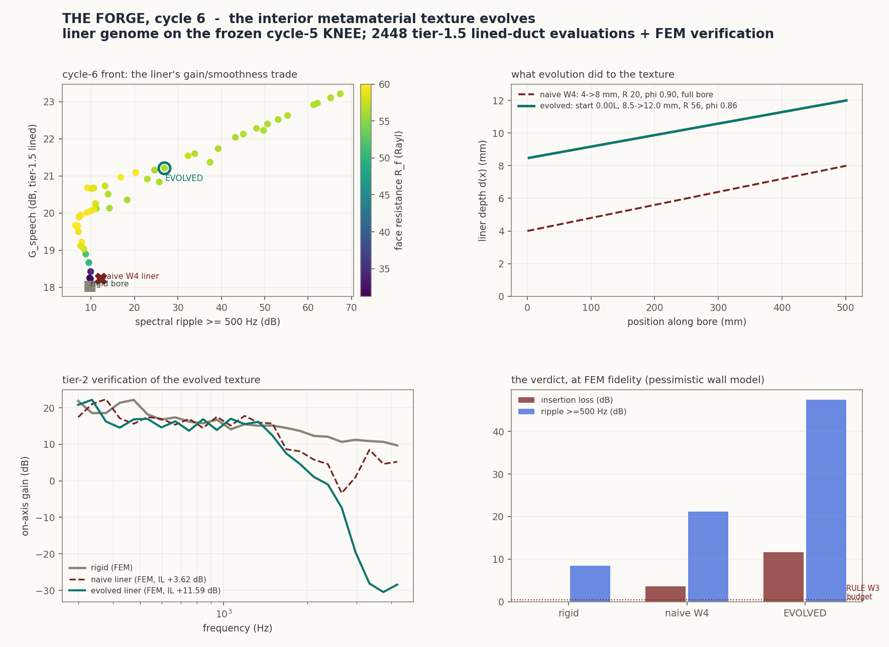

**The naive surface failed the FEM.** Modeled as a locally-reacting rigid-backed layer
(`Z_w = R_f + i(ρc/φ)cot(kd)`), the hand-specified W4 liner costs **+3.6 dB** of voice
(budget: 0.4) and doubles ripple; even the thinnest lawful "floor" texture (3 mm, φ 0.85) costs
+1.9 dB. The rim fringe fared worse: a locally-reacting "matched rim" *absorbs* (−6 dB in the
squillo band) where a real fringe *transmits* — the model class cannot represent the anti-etalon
at all. Fringe verification is deferred to an unbaffled two-domain mesh (or the rig).

**The texture evolution (cycle 6) then invalidated its own evaluator.** A 5-gene liner genome
(coverage start, depth grading, face resistance, porosity) evolved against a tier-1.5 lined-duct
model (`k_z² = k² − 2ikβ/a`) — and its "winner" (+3.2 dB *gain* claimed) re-scored at
**−11.6 dB in the FEM**. The lined-duct approximation is anti-correlated with truth for strongly
reactive walls; it is hereby rejected as an evaluator. The funnel caught its own tier for the
second time (first the piston DI, now this), which is the funnel working.

**What survives is a real rule.** The two model classes describe two different physical objects:

- A **sealed liner** (cavity behind a face sheet, or a lattice dense enough to decouple):
  locally-reacting compliance, detunes and damps the horn — the FEM's 2–12 dB damage is real
  *for that object*.
- An **open lattice** (φ ≥ 0.85, strands 0.2 mm ≈ `ka = 0.015` at 4 kHz, scattering ∝ `(ka)⁴`,
  pores laterally connected): the wave treats the liner zone as *duct*, not *wall* — an
  effective medium with `n_eff − 1` of a few percent confined to an annulus a few percent of the
  cross-section: net phase perturbation ~0.3%, invisible, as RULES S1/W1 argued all along.

`[RULE W5] — The Fleece must never become a wall.` No face sheets, no dense slicer skins or
solid first layers at the lumen face of the lattice, no sealed backing volumes; porosity ≥ 0.85
with open cell connectivity throughout. The distance between the two regimes is the distance
between −0.0 dB and −11.6 dB, and a slicer default ("surface skin: on") is enough to cross it.
**The decisive experiment** is already in the plan: test pass 7's bare-flare A/B print now
discriminates the model classes directly — measured IL ≈ 0 dB confirms the effective-medium
regime; measured IL of dB-order means the print accidentally built a liner, and RULE W5 was
violated somewhere in the toolchain.

### Cycles 7 and 8, executed — the other two families enter the Forge

Until these cycles, every search and every FEM ran on the Clarion family alone. Cycle 7 runs the
**Volute** (corrected evaluator plus its signature *packing gate*: channel width must fit the gap
between successive spiral turns, `gap = r_c(e^{2πk}−1)`, walls included, fold inside Ø310), and
cycle 8 runs the **Halo** as what it actually is — a lumped acoustic network (chamber compliance,
radiating slot, four shunted Helmholtz branches, glottal Norton source), where the four
resonators share the chamber and **pull each other**.
Code: [evolve_volute_c7.py](../projects/voice-horn-evolution/evolve_volute_c7.py),
[evolve_halo_c8.py](../projects/voice-horn-evolution/evolve_halo_c8.py).

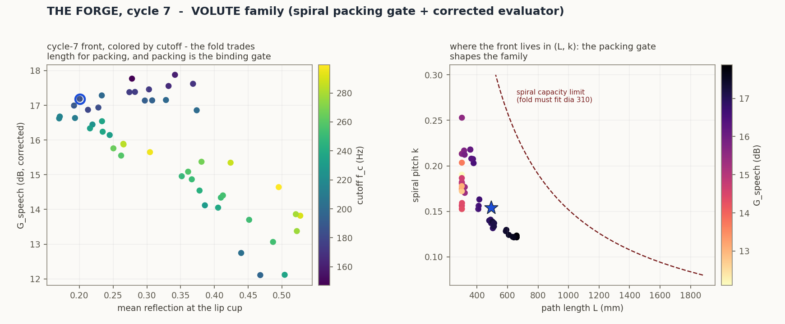

**Cycle 7 — the Volute wants to be tall.** The family front spans cutoffs 147–299 Hz (the warmth
mission confirmed by evolution: this family genuinely reaches below the Clarion's floor). But the
hand Volute, as parameterized, **fails the packing gate outright** — with a 110 mm channel
height, the mouth-end width (S/H ≈ 430 mm) is nearly twice the available inter-turn gap. Rev 1
hand-waved the cross-section morph; the gate arithmetic says it never packed. Evolution's fix is
unanimous across the front: **drive channel height to the 200 mm bound** — tall, narrow channels
keep widths inside the spiral gap. The KNEE (r_t 22, Ø246-equiv mouth, L = 506 mm, k = 0.14,
H = 200) delivers `G = 17.2 dB` at `Γ̄ = 0.201` with `f_c = 185 Hz`, feasible. **Design change:
the Volute body grows to ~210 mm tall and its channel schedule is height-first** — the nautilus
stands upright.

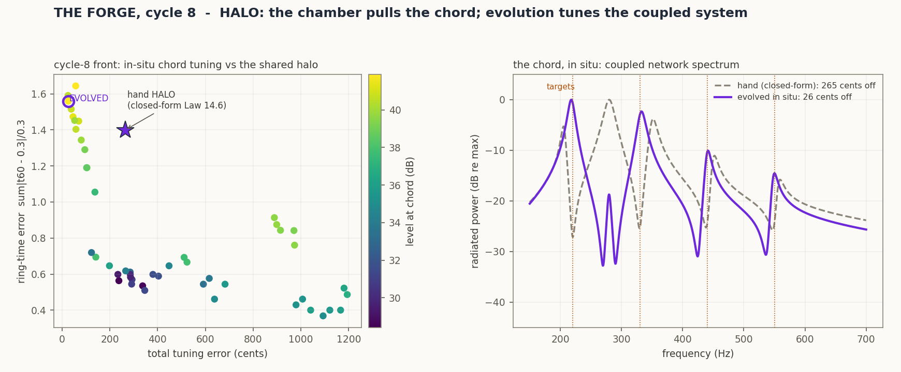

**Cycle 8 — the chamber pulls the chord, badly, and evolution retunes it.** The Rev-1 Halo's
closed-form volumes (Law 14.6, resonators tuned in isolation) land **265 cents off in situ** —
the shared chamber compliance drags the coupled resonances; the E4 sphere alone rings nearly a
semitone and a half flat (visible in the spectrum panel). The evolved genome retunes the coupled
system to **26 cents total (~7 per note)** while improving chord-band radiated level by ~19 dB
(bigger neck, optimized slot): the correction inflates the upper spheres dramatically —
**V₂ +91%, V₃ +58%, V₄ +54%, V₁ −2%** (402/349/162/102 cm³). **Design change: the print volumes
in the Halo section are superseded by the in-situ set.** One honest residual: neither hand nor
evolved hits the 0.3 s shared ring time in this network model (viscous-only neck losses put the
Q's elsewhere) — t₆₀ stays what the tuning plugs and the rig are for, exactly as §16 planned.

With these two cycles, **all three POCs have now been through the Forge** — each against physics
appropriate to its kind: transfer-matrix horn chains for Clarion and Volute (with the FEM-derived
directivity correction), a coupled lumped network for the Halo, and the geometric gates
(bed, spiral packing, anatomical throat) binding where each family actually hurts.

### Cycles 9–11, executed — the deepening pass, all families

One more pass over all three POCs, each with a richer genome where its last cycle showed strain,
and 2–3× the budget. Code:
[evolve_clarion_c9.py](../projects/voice-horn-evolution/evolve_clarion_c9.py),
[evolve_volute_c10.py](../projects/voice-horn-evolution/evolve_volute_c10.py),
[evolve_halo_c11.py](../projects/voice-horn-evolution/evolve_halo_c11.py).

**Cycle 9 — Clarion: the family is converged.** A 3-segment piecewise-exponential bore (each
segment its own flare constant) and pop 96 × 120 bought only +0.9 dB at the gain corner
(19.2 → 20.1 dB) and a KNEE statistically identical to cycle 5's (18.2 vs 18.1 dB, at *higher*
print cost); zero members dominate the cycle-5 KNEE. Diminishing returns declared: **the
projector Clarion is design-complete at tier-1.5 fidelity — print the cycle-5 KNEE.** Further
gains live in tier 3 (the rig), not in more search.

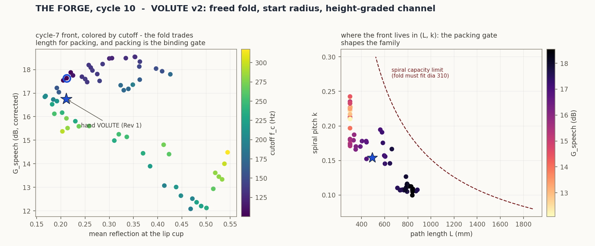

**Cycle 10 — Volute v2: the chest register comes inside the bed.** Freeing what cycle 7 froze
(spiral start radius, fold fraction, and a *height-graded* channel `H(x)`) vindicated the hand
design's original intent — with graded height the Rev-1 Volute **passes the packing gate**
(cycle 7's fixed-height parameterization was what condemned it, a parameterization artifact now
corrected) — and pushed the family's reach dramatically: the new KNEE folds an **871 mm path**
(k = 0.11, from r₁ = 46, channel 95 → 246 mm tall, fold 0.67) for **f_c = 100 Hz** at
`G = 17.6 dB`, `Γ̄ = 0.212`. The Volute's mission was felt support and warmth; its cutoff just
dropped from 170 to **100 Hz — the singer's chest register itself**, inside a Ø310 body.

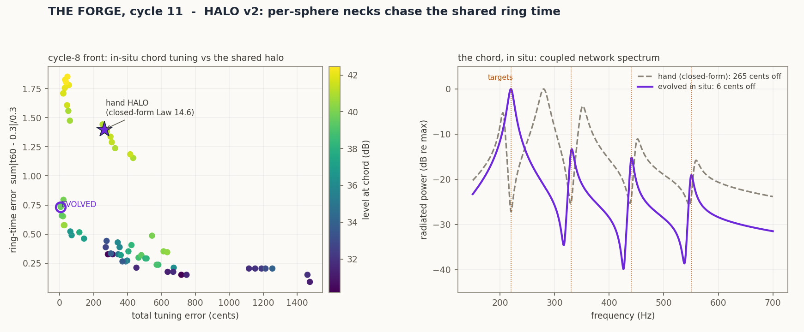

**Cycle 11 — Halo v2: the chord snaps into tune and the halo evens out.** Per-sphere neck radii
(10 genes) were predicted to fix the ring-time failure, since neck viscous loss gives
`Q ∝ a_n √f` — constant t₆₀ wants bigger necks on higher spheres. Evolution confirmed the
scaling exactly: **necks ascend with pitch (5.4 / 11.1 / 14.9 / 14.4 mm)**, tuning error falls
28 → **6 cents total** (~1.5 per note — imperceptible), and ring-time error halves (1.59 → 0.73)
at essentially equal chord level (39.7 dB). **The Halo print spec is superseded again:**
V = 626/212/189/113 cm³, per-sphere neck radii as above, L_n = 35 mm, slot 4 mm — closed-form
Law 14.6 remains the *teaching* derivation; the coupled network's numbers are the *build*
numbers, with the plugs for the last few cents.

The deepening pass's meta-lesson, worth recording: the three families ended in three different
states — one **converged** (Clarion: stop searching, start printing), one **transformed**
(Volute: a parameterization fix unlocked an octave of reach), one **perfected within its model**
(Halo: 6 cents, awaiting only physical Q). A fixed cycle count would have served all three
poorly; running each family until *its own* front stops moving is the discipline.

### The Forge v2 stack (adopted for industrialization)

A second supplied brief proposes the production toolchain: **pymoo + CadQuery + custom 1-D
evaluator + gmsh/Elmer for finalists + scikit-learn surrogates + SALib screening + SQLite/Parquet
logging + pinned env**. Adopted, with the session's experience annotated onto it:

- Already satisfied here: the custom transfer-matrix evaluator, gmsh meshing, hard
  manufacturability constraints, one-family-at-a-time discipline, five-objective cap, repeated
  baselines, and the funnel (whose value cycles 5–6 proved empirically — twice).
- To adopt at the next rebuild: **pymoo** replaces the self-contained NSGA-II (which served for
  seed-reproducible cycles 1–6 but lacks duplicate elimination and reference-point methods);
  **CadQuery** (already in PYTHON_TOOLING's stack) turns each Pareto genome into a STEP/STL
  solid so the gate can check real geometry; **SQLite + Parquet** replaces the per-cycle CSVs —
  every genome, mesh, sim result, print setting, and rig measurement in one queryable record;
  **SALib** screening before cycle 7 (the bulge genes and `L_e` look freezable); scikit-learn
  GP surrogates once 15–30 prints exist. Check PYTHON_TOOLING before each install — the
  environment has drifted once already.
- One addition the brief underweights and cycle 6 makes urgent: **OpenFOAM (or any CFD) is the
  first tool in the stack that can see the Fleece's actual function** — the DC breath. Elmer or
  the unbaffled FEM handles the fringe. Both belong at the "finalists only" tier.
- Migration target: `projects/voice-horn-evolution/` → the proposed `hornopt/` package layout
  when cycle 7 begins; the six cycle scripts stay as the frozen experimental record.

### What the Forge simulates — and deliberately does not

A scope note, so the tiers are never oversold. Tier 1 evolves and scores **macro-geometry
only** — the plane-wave pressure chain of cup, tube, step, and bore. The interior metamaterial
layers are *frozen and absent from the acoustics by design*: the Fleece is engineered under
RULE W3 to present ≤0.4 dB to the voice (its measured anchor is F4), so at tier-1 fidelity it is
correctly modeled as **nothing**. Its designed interaction is with the **DC breath** — turbulence,
plosive momentum, jet noise — which no linear acoustic solver at any tier can see; that physics
is validated by measurement (test pass 7's wind/word split), or by CFD if it is ever worth the
cost. The two skin features that *do* touch the voice — the rim fringe's graded radiation
boundary and the QRS diffuser ring — are 2-D/3-D boundary effects: tier-2 territory
(fringe as a graded-admittance boundary in the axisymmetric FEM; the QRS as a locally-reacting
impedance patch or a small 3-D solve). Evolving bore shape at tier 1 while holding the
law-derived skin fixed is the intended division of labor: **the laws design the metamaterial;
evolution designs the air column it dresses.**

### Rig upgrades (amending Part XVI's steps for Forge cycles)

Adopted from the proposal: a fixed small full-range driver + printed artificial-mouth coupler as
the source (a speaking human is the *final* judge, not the fitness function); reference mic at
the throat and measurement mic at 1 m; indexed turntable at 0/±15/±30/±45/±60/90/180°; log-swept
sine + deconvolution for impulse response and polars; **one reprinted baseline in every physical
batch to quantify drift**; and a per-print record — design ID, gene vector, slicer settings,
mass, measured bore dimensions, leak test, SPL/polar/reflection curves, subjective notes. The
discipline that matters most: distinguish a design's acoustics from a seam leak or a bore-size
shift before believing either.

### Surrogate stage (cycle 3+)

After 15–30 measured prints: per-metric regressors (Gaussian-process class first for uncertainty
under small data), NSGA-II against the surrogate for thousands of virtual candidates, and print
batches chosen to be jointly *predicted-good and uncertain/diverse* — surrogate-assisted
evolution in the standard sense. Check PYTHON_TOOLING before adding any modeling dependency.

*References supplied with the brief (not independently verified — §18.3 discipline applies):
NSGA-II/multi-objective medical-device optimization ([PMC12473346](https://pmc.ncbi.nlm.nih.gov/articles/PMC12473346/)),
horn-contour impedance/directivity optimization ([PubMed 32359259](https://pubmed.ncbi.nlm.nih.gov/32359259/)),
manufacturability filters in acoustic topology optimization ([PubMed 40326791](https://pubmed.ncbi.nlm.nih.gov/40326791/)),
surrogate-assisted evolution under low budgets ([HAL 04096875](https://hal.sorbonne-universite.fr/IRT-SYSTEMX/hal-04096875v1)),
and the COMSOL horn-shape example ([comsol.com/model/4353](https://www.comsol.com/model/optimizing-the-shape-of-a-horn-4353)),
whose on-axis-only caution our §15.4 row 5 already encodes.*

---

## Which to build first, and how to test

**Build order: A → C → B.** The Clarion is Part XVI step 1 almost verbatim (plain horn first) and
directly attacks open question 8 — the branch's most important unknown (on-axis SPL delta at 2 m,
1–4 kHz). The Halo is the cheapest big payoff after that: its acceptance test is objective and
delightful. The Volute is the most printing for the most subtle benefit; build it once A has
calibrated expectations.

Per Part XVI, for each device:

1. Swept sine 100 Hz–8 kHz before any voice; waterfall for nulls, peaks, ring-down.
2. **Clarion pass:** on-axis vs 30/60/90° at 2 m; consonant phrases ("Peter Piper…"), §15.4
   checklist. Success = measurable 1–4 kHz on-axis lift with no new narrowband feature except the
   2.4–3.4 kHz lift at ≤5 dB, Q ≤ 65.
3. **Halo pass:** ring-down at each resonance → measured Q vs 30/45/60/75; adjust plugs; then a
   chanted A3 — success = audible chord tail ≈ 0.3 s and no flutter on a straight tone. This also
   executes open question 12 (the FM→AM law) for free: add a deliberate 6 Hz vibrato and measure
   the wobble against `10·log₁₀(1+(2Qe)²)`.
4. **Volute pass:** identical program to A plus a singer's report of phonation ease at 170–300 Hz
   (the loading claim is partly proprioceptive; log it as such).
5. **Skin pass, all three:** swept sine with and without the lining feature engaged where possible
   (tape over the QRS wells / rib field) — RULE S1 predicts *no measurable change below the
   feature's design band*; any low-frequency delta means the budget math or the print is wrong.
   Haptic acceptance is a blind hand test: a first-time holder should find the grip zone within
   three seconds without instruction. That is the gradient doing its job.
6. **Script pass:** the motto ring must not change the swept response outside 3.5–14 kHz (RULE S4
   inherits RULE S1's prediction); braille acceptance is a braille reader confirming the tuning
   triple by touch; voice-groove acceptance is measuring three groove peaks with calipers and
   recovering the pitch contour to within ~10% via the 754 mm/s sampling law.
7. **Fleece pass — the wind/word split, measured separately by construction:**
   - *Word:* swept sine (no flow) with and without the liner (print one bare flare as control).
     RULE W3 predicts ≤0.4 dB insertion loss and no new spectral feature; more means the porosity
     or pore floor missed.
   - *Wind:* breath-only (unvoiced exhale, then plosive bursts "p-p-p") into each horn, mic at 1 m
     on-axis. The Fleece must cut unvoiced breath noise and pop transients measurably (predict
     several dB broadband; this is the one Fleece number the laws bound only loosely — measure
     it); any *tonal* line in the breath spectrum is a whistling strand: find the local `U`, and
     RULE W2 says which region violated `Re < 47`.
   - *Halo cowls:* each sphere's resonance must hold frequency and Q with full breath flowing
     (uncowled control will detune and hiss — that contrast is the acceptance).

Every number above inherits nothing from `c_L` — the audible branch runs on `c_air` alone — so
none of it waits on the §17.1 measurement. These three can print tomorrow.
