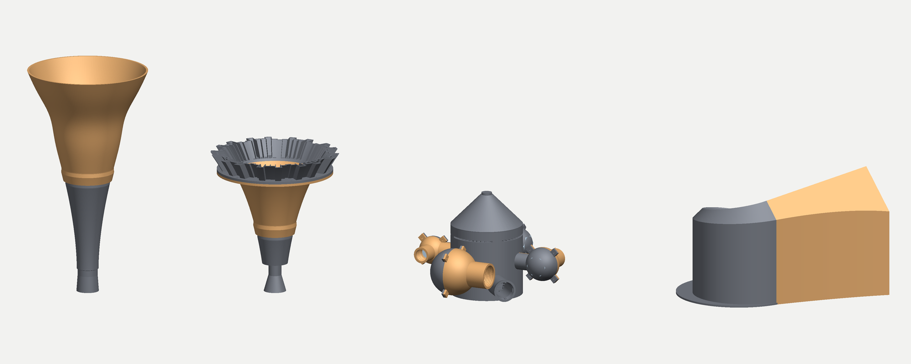
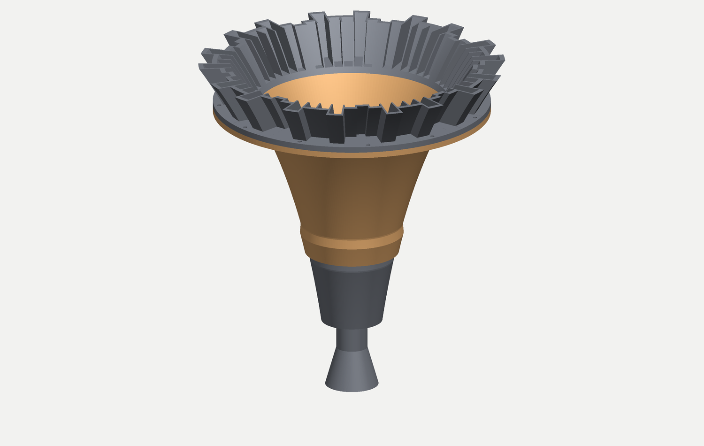
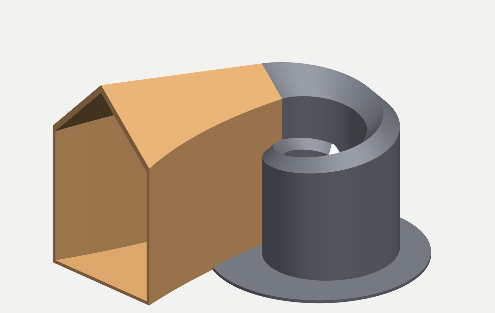
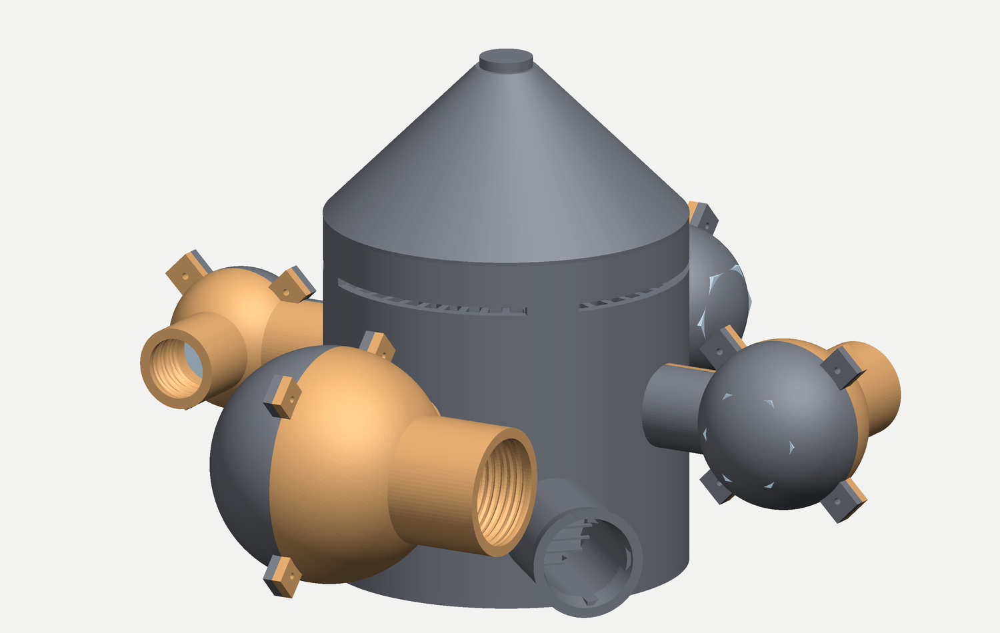

# Voice-horn POCs — printable parts

STL generators for the three acoustic-metamaterial voice instruments of
[docs/voice-horn-pocs.md](../../docs/voice-horn-pocs.md) (Rev 6), built from the
**evolved** genomes the doc's Forge section calls for — not from the Rev-1 hand numbers,
except where the doc explicitly keeps them.



```bash
python build_all.py              # everything: plain smooth bodies
python build_all.py --skin       # opt-in ornament pass (claws, grips, braille)
python clarion.py --variant s    # one family at a time
python volute.py --pack          # the packing check, no geometry
python fit_check.py              # assembled-position boolean fit of every joint
python preview_set.py            # assembly renders from the printed parts
```

Every part is validated **on the exported file** (STL is float32, and rounding can pinch a
mesh that was manifold in memory): watertight, single body, and inside the 320 mm bed
measured as the minimum-area rectangle of its footprint, since parts may rotate on the plate.

| | genome | headline | parts |
|---|---|---|---|
| **A projector** | cycle-5 KNEE, `pareto_c5.csv` | f_c 206, f_match 380 Hz, 558 mm long, Ø287 mouth | 3 |
| **A squillo** | Rev-1 hand chain | f_c 302, f_match 437 Hz, 1:5.8 step, Ø250 mouth | 4 |
| **B Volute** | cycle-10 KNEE, `pareto_c10.csv` | **f_c 100 Hz**, 871 mm path folded 1.18 turns | 3 |
| **C Halo** | cycle-11, `pareto_c11.csv` | just chord on A3, **6.2 cents** as built | 13 |

24 parts, ~7.1 L of solid wall ≈ **5.3 kg of PETG** sliced as the F1 sandwich.
Build order per the doc: **A → C → B**.

---

## The Skin (opt-in)

**The printed set is the plain smooth bodies** — every exterior clean, every bore glass.
The full ornament pass still exists behind `--skin` (it is the doc's RULE S2/S3/S4
apparatus): sharp two-segment claws with 0.18 mm tips replacing the old thorn studs, a
sculpted right-hand grip print per instrument (+2 mm bulge band, four canted finger pits,
an opposed thumb pit, carved back to nominal so the 5 mm wall is never thinned), braille
rings as the grip's clocking reference, Halo pinch saddles and plug-hex scallops. A
full-surface relief skin (ridged noise / Voronoi shards / flow ridges) was also built on
top of it and rejected on looks; its generators remain in `horn_lib` unused. Since the
plain bodies ARE the `--no-skin` controls of test passes 5 and 7, the default build and the
control build are now the same thing.

---

## Walls, layers, infill

The 5 mm wall in every STL is geometry only. Slice it as the **F1 sandwich** — two
perimeters (~1.7 mm/face) over **40 % Grid** infill, the most reflective printed structure
in Zvoníček et al. (β_m = 0.963, out-reflecting 100 % solid at 0.852).
**Cubic infill is banned from every acoustic body (F3).**

Layer height **0.3 mm** for all bodies (F2 — layer stepping is acoustically nearly free),
**0.16 mm** only for the parts whose *geometry* needs it: the QRS ring, the pop cages and
the Fleece coupon. That split is why the QRS ring is a separate part at all.

---

## POC-A — Clarion (two lanes, as cycle 3 split it)

### Projector — `clarion_p_*`

The cycle-5 KNEE, gene for gene:
`r(u) = r_t + (r_m−r_t)u^n + A(r_m−r_t)·exp(−((u−x0)/0.12)²)·sin(πu)`,
`r_t 21.695, r_m 143.575, L 501.263, n 1.7373, A −0.1411, x0 0.80`, behind the Ø39.2 × 16.5 mm
tube and its 1.22:1 step. Evolution removed the opera singer here — the tube's quarter wave
lands at 2.6 kHz with no decoupling step, so this lane projects and does not ring.

| part | prints | notes |
|---|---|---|
| `clarion_p_throat` | cup down, 300 mm tall | plain; M-thread spigot (grip print + braille only with `--skin`) |
| `clarion_p_bell` | bell down, Ø297 | plain flare (claw crown only with `--skin`) |
| `clarion_p_popcage` | flat | slips into the bore one area-step downstream (RULE W2) |

Joint: single-lead trapezoidal thread, 8 mm pitch, 1.5 mm deep, 0.35 mm clearance. Male and
female are generated from the *same* field function, so they mate by construction.



### Squillo — `clarion_s_*`

The Rev-1 chain the doc keeps as a deliberate §15.9 colorist instrument: Ø45 cup → **Ø22 × 30 mm
epilarynx tube → 1:5.8 step** → 280 mm exponential bore `26.5·(125/26.5)^u` → Ø250 mouth.
Computed here: f_c 302 Hz, f_match 437 Hz — the doc's own 303/437.

`clarion_s_qrs_ring` is the **Motto Ring**: 63 quadratic-residue wells, 9 periods of N = 7,
depths `(n² mod 7)×7 mm = 0/7/28/14/14/28/7`, design frequency 3.5 kHz, on the Ø250 rim whose
785 mm circumference is exactly the doc's 63-slot arithmetic. The outer wall steps *with* the
sequence rather than running at max depth, so the ring's own silhouette is the crown — and at
Ø316 in a 320 bed there is no room to add ornament to it.

Print it **wells-up**: every well floor is then a flat surface over solid material, no bridging.
It bolts to the bell with 12 × M4 on a Ø275 circle.

---

## POC-B — Volute



Acoustics verbatim from the cycle-10 KNEE: `r_t 23.9624, r_m 118.8258, L 871.1085, k 0.10574`,
`S(x) = π r_t² e^{mx}` → **f_c 100 Hz**, G 17.6 dB, Γ̄ 0.212.

**The layout is re-derived, and here is why.** The c10 packing gate tests each winding against
`gap = r_c(e^{2πk} − 1)` — the spacing to the turn *outside* it — while the binding neighbour is
the turn *inside*, whose spacing is smaller by e^{2πk}, and the half-width that must fit beside
it is the outer turn's, not the inner one's. Run `python volute.py --pack`:

```
published c10: r1  45.5  H  95.4->245.5  fold 0.6745  turns 1.29  worst wall-to-wall -14.8 mm OVERLAP
built here   : r1  52.0  H 130.0->290.0  fold 0.6745  turns 1.18  worst wall-to-wall  +1.4 mm OK
```

The published spiral passes through itself by 14.8 mm. The fix costs nothing acoustically,
because `S(x)`, `H(x)` and `L` set the 1-D chain while the fold only sets where the duct is bent:
**raise the height grading to 130 → 290 mm and the start radius to 52 mm.** Same f_c, same G,
same fold fraction, same one-piece 284 mm bell. (H1 = 290 is outside the c10 gene bound of 280;
H is acoustically free, so the bound was a search-space choice, not a law.)

**The cross-section is a flat floor, vertical sides and a 45° pointed vault**, with the width
solving `w²/4 − wH + S = 0` so the area the vault removes is given back by the width and `S(x)`
stays exact. The vault is what lets the body print in one piece, floor down, **no lid and no
support** — and it deletes the doc's micro-perforated lid absorber along with the flat lids it
was designed to damp.

| part | prints | notes |
|---|---|---|
| `volute_body` | floor down, 311 × 288 × 255 | folded 588 mm of path, 1.18 turns, integral base plate |
| `volute_bell` | floor down, 305 × 191 × 307 | the unrolled 284 mm; lap plug into the body's port |
| `volute_mouthpiece` | big end down | the modelled 40 mm cup taper, swung 62° so the Ø45 cup lands in the clear centre |

The base plate is **notched** where the bell and the mouthpiece land, so both neighbours keep a
full 5 mm floor instead of being shaved to clear the disc, and the notch locates the part.
Both lap plugs are swept on the *body's* own duct frames — over 18 mm of insertion the spiral's
lateral axis turns 9°, and a plug swept on its own straight axis drives its corners into the wall.

One honest 0.5 %: sections are cut in radial-vertical planes (so the joints mate), which shears
them 5.6° off the path normal — `cos 5.6° = 0.995` on area.

---

## POC-C — Halo



The cycle-11 set: `V = 626.06/207.25/188.79/112.45 cm³`, per-sphere neck radii
`5.51/10.94/14.88/14.42 mm` ascending with pitch, `L_n 34.84`, slot 4 mm.
`python halo.py` re-runs the cycle-11 lumped network **on the as-built numbers** and prints:

```
as-built chord: 220.0Hz(+0.0c)  330.5Hz(+2.6c)  440.5Hz(+2.0c)  550.5Hz(+1.6c)
total tuning error 6.2 cents  (published cycle-11 figure: 6.2)
```

Three build decisions:

* **The lid becomes a 45° cone.** The chamber's *volume* is the acoustic quantity, so cylinder +
  cone − ribs is solved to the model's 4.021 L exactly. The chamber then prints upright in one
  piece with no lid, no support, and no 168 mm bridge.
* **The chamber radius is 84 mm, not 80.** The graded rib array (8 → 12 mm, 48 ribs) eats 0.32 L
  of cavity; the radius pays it back.
* **The wind cowls become flush grilles** — 1 mm bars on 7 mm centres, 86 % open — across each
  neck mouth and the inlet. A mesh dome cannot be printed inside a sealed chamber; a grille does
  the same job (transparent to a 220–550 Hz chord, opaque to the DC flow that would otherwise
  make an ocarina of a tuned neck).

Each sphere is split on the **vertical plane through its neck**, so both halves print dome-up off
a flat face with the half-neck as a groove in it; 4 × M3 ears clamp them. The tuning plug enters
on the axis perpendicular to that plane, giving ±10 % of volume (≈ ∓5 % in pitch — the chord
centres anywhere from ~G3 to ~B3 without a reprint).

| part | prints | notes |
|---|---|---|
| `halo_chamber` | upright, floor down | ribs, slot with 4 posts, 4 threaded neck bosses, inlet + cup, grilles |
| `halo_sphere{1..4}_{a,b}` | flat face down | a-half carries the plug boss; b-half is plain |
| `halo_plug{1..4}` | head down | Ø53/37/36/30, travel 57/39/38/32 mm |

Assembled span ≈ Ø459. Seal the sphere halves and the neck threads — a Helmholtz Q is spent by
leaks before anything else.

---

## The Fleece

`fleece_coupon` is the A/B control test pass 7 asks for: a 30 mm graded lattice sleeve whose
**strand diameter is solved per layer** to hit RULE W4's porosity grade instead of guessing one
strand size:

```
lumen -> wall:  cell 3.4 strand 0.40 phi 0.95 | 2.9 / 0.47 / 0.92 | 2.3 / 0.51 / 0.89 | 1.8 / 0.51 / 0.85
```

Its registration band is on the **wall side only** — a dense skin at the lumen face is exactly
what RULE W5 forbids, and the distance between the two regimes is the distance between −0.0 dB
and −11.6 dB. Print the bare-flare control with `--no-skin` and measure the pair.

`clarion_*_popcage` is the pop cage: two offset crossed grids of 0.4 mm strands at 2.5 mm pitch,
sitting one area-step downstream of the constriction, where RULE W2's `Re < 47` bound allows a
mesh at all.

---

## Fit check

Every mating pair was boolean-intersected in its assembled position; what is left is the fit
clearance, not a collision:

Run `python fit_check.py` to reproduce this table on the exported files:

| pair | residual overlap |
|---|---|
| Clarion throat ↔ bell (both lanes), squillo bell ↔ QRS ring, Halo sphere halves | 0 mm³ |
| Halo chamber ↔ sphere (threaded) | ~150 mm³ — the collar's root ring biting ~1 mm into the chamber wall corner (the stub starts at R_CH+4, the wall face is at R_CH+5). Pre-existing: the bare `--no-skin` parts measure the same, so the Skin adds nothing here. In PETG it means the sphere seats 1 mm proud; a known niggle, not a Skin regression |
| Volute body ↔ bell plug | 155 mm³ over ~600 cm² of lap — a chordal film under 0.1 mm |
| Volute body ↔ mouthpiece plug | 68 mm³, same cause |

Threads are 8 mm pitch × 1.5 mm deep (horns, 0.35 clearance) and 4 × 1.2 (Halo, 0.5 — printed
PETG threads want the slack); Volute lap plugs run 0.5 mm. Both halves of every thread come from
one field function, so changing the pitch changes both at once. Seal the Halo spheres and the QRS
ring joint — a resonator's Q and a horn's mouth reflection are both spent by leaks.

## Not built here

* **The full Fleece liner** (~43,000 cells, ~500 m of strand on the Clarion alone) — it is a
  ~4 M-triangle mesh per horn. The coupon and the pop cage carry the rules; the liner wants a
  slicer-side lattice modifier or a per-segment generator run, not a monolithic STL.
* **Latin lettering** — the Motto Ring's Schiller inscription, the Volute's self-inscription and
  the Clarion's voice groove. The braille of RULE S4 is built by the `--skin` pass (Grade 1,
  name + tuning triple + owner line, 0.6 mm domes inside the ≤1 mm grip budget), not in the
  plain default; glyph outlines need a font→outline pipeline that this generator does not have.
* **The rim fringe as a lattice.** The bells carry a plain rim; the anti-etalon fringe belongs
  with the Fleece pass, and cycle 6 showed the model class we have cannot even represent it.

---

## Files

`horn_lib.py` — the mesh kit. A printable shell is two radius *fields* over one (z, θ) grid, so
bore profile, helical threads, QRS wells and rib arrays are all additive terms on a field and the
result is watertight by construction. Ornament is emitted as disjoint solids and unioned once
through manifold3d; lattices are swept tubes, one per hoop or rail.

`clarion.py` · `volute.py` · `halo.py` — one POC each, each runnable alone.
`build_all.py` — the whole set plus the mass estimate. `fit_check.py` — the assembled-position
boolean fit table above. `preview.py` / `preview_set.py` — renders.

The texture kit lives in `horn_lib`: `pit_field`/`pit_depth_at` (smooth flat-bottomed hand
pits), `claws` (two-segment sharp spikes — note it returns [roots, tips] as two meshes for
the union, since manifold3d rejects a single mesh whose own bodies overlap), and
`smooth_band` (the C1 window everything is gated by). `ridge_noise` and `voronoi_shards`
(continuous relief fields) are in the kit but currently unused — a full-surface skin was
built with them and rejected on looks. The Volute, having no axis of revolution, applies
pit/bulge fields to its loft sections in `texture_secs` instead.
